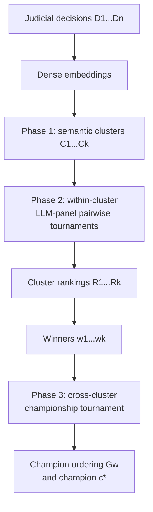

# Embedding-Seeded Hierarchical Tournament Ranking: A Scalable Method for Evaluating Judicial Decision Quality with LLM Panels

**Franklin Silveira Baldo**
Procurador do Estado de Rondônia (OAB/RO 5733)
Porto Velho, Brazil

---

> **Position paper.** This article proposes a method and an evaluation
> protocol. No empirical results are reported. The Semantic Proximity
> Hypothesis is stated as a falsifiable prediction to be tested, not
> as a confirmed finding.

## Abstract

Evaluating the quality of judicial decisions at scale is an open
problem in computational legal reasoning. Existing LLM-as-judge
approaches apply pairwise or tournament-style comparisons to
homogeneous sets of outputs, but judicial corpora are intrinsically
heterogeneous: decisions span different subject matters, procedural
stages, and levels of jurisdiction, making direct comparison
unreliable. We propose **Embedding-Seeded Hierarchical Tournament
Ranking (ESHTR)**, a three-phase protocol that (1) clusters
decisions by semantic similarity using dense embeddings, (2) ranks
decisions within each cluster via an LLM judge panel, and (3)
conducts a cross-cluster championship tournament among
intra-cluster winners. The embedding-first step is intended to act
as a principled seeding mechanism, so that early-stage comparisons
occur between semantically similar decisions — where we expect LLM
judges to be more reliable — while the cross-cluster phase is
designed to surface globally exceptional decisions. We motivate the
method theoretically by connecting known non-transitivity failures in
LLM-as-judge pipelines to semantic distance between compared items,
and treat the prediction that stratifying comparisons by similarity
reduces non-transitivity as an empirical hypothesis rather than an
established causal mechanism. We outline an evaluation protocol using a
heterogeneous panel of frontier LLMs as synthetic jurors with
structured rubrics anchored to Brazilian CPC procedural criteria
(art. 489, §1º; art. 927), calibrated against known-quality writing.
The contributions of this article are conceptual: the method, its
theoretical motivation, the evaluation rubric, and a set of
falsifiable predictions. We do **not** report measurements; the
empirical validation of ESHTR on a Brazilian state court corpus is
left for future work.

---

## 1. Introduction

The quality of judicial reasoning is at once one of the most
consequential and hardest-to-measure properties in legal systems.
A judicial decision that suppresses a material argument, applies
a binding precedent selectively, or grounds its dispositif in
claims that were contingent obiter dicta of prior decisions can
propagate reasoning errors across subsequent stages of the same
proceeding and into the broader jurisprudential record. Yet
assessing reasoning quality at scale — across thousands of
decisions per year in a single state tribunal — has historically
required expert human review, which does not scale.

The emergence of large language model (LLM) evaluation pipelines
offers a promising alternative. LLMs trained on legal corpora
can apply structured rubrics to judicial text, identify
argumentation gaps, and compare decisions along multiple quality
dimensions. Several works have shown that LLM-as-judge approaches
produce judgments that correlate meaningfully with expert human
annotation (Zheng et al., 2023; Verga et al., 2024).

However, existing LLM-as-judge protocols have been designed for
*homogeneous* evaluation settings: comparing multiple responses
to the same prompt, rating model outputs on identical tasks, or
scoring papers submitted to the same conference. Judicial corpora
are fundamentally different. A corpus of state court decisions
encompasses criminal, civil, administrative, and labor matters;
decisions at trial level, appellate level, and en banc; rulings
on interlocutory motions, final judgments, and post-judgment
motions. Comparing a criminal sentencing decision directly to a
tax law injunction ruling asks an LLM judge to reconcile contexts
that share procedural vocabulary but differ in substantive
reasoning standards, evidentiary frameworks, and applicable
precedent hierarchies.

The core problem this heterogeneity may create for existing methods
is not merely one of comparability in an intuitive sense. It may
interact with the non-transitivity failures documented in recent
LLM-as-judge literature (see, e.g., the non-transitivity analyses
cited in Section 2.1). Our specific hypothesis is that semantic
distance can destabilize the evaluative frame used across
comparisons, but this must be distinguished empirically from other
known drivers of comparison difficulty, including small quality
margins between candidates. Non-transitivity undermines tournament
rankings: if the judge prefers A over B and B over C but C over A,
the tournament outcome can become bracket-sensitive rather than a
reliable quality signal.

We propose **Embedding-Seeded Hierarchical Tournament Ranking
(ESHTR)** as a principled response to this problem. The key
insight is borrowed from competitive sports: seeding. In a
well-designed tournament, teams are seeded to ensure that early
rounds pit similarly-ranked competitors against each other, with
cross-tier matchups deferred to later rounds when the pool has
been filtered. We adapt this logic to judicial evaluation: use
dense text embeddings to group semantically similar decisions
into clusters (seeding by type), rank within each cluster where
comparisons are most reliable, then conduct a championship round
among intra-cluster winners to identify cross-cluster champions.

**Contributions.** This paper makes three contributions:

1. **A method**: ESHTR, a three-phase protocol combining
   embedding-based clustering, intra-cluster LLM-panel ranking,
   and cross-cluster championship tournament.

2. **A theoretical motivation**: we connect non-transitivity
   failures in LLM judges to semantic distance between compared
   items and formulate the effect of semantic proximity on
   reliability as a controlled, falsifiable hypothesis.

3. **An evaluation protocol**: a structured LLM panel rubric
   anchored to Brazilian CPC procedural criteria, with
   calibration methodology and inter-judge agreement metrics,
   demonstrating the method on a corpus of Brazilian state
   court decisions.

---

## 2. Background and Related Work

### 2.1 LLM-as-Judge Evaluation

The LLM-as-judge paradigm was established by Zheng et al. (2023)
with MT-Bench and Chatbot Arena, demonstrating that GPT-4 achieves
markedly higher agreement with human preferences in pairwise
comparison mode than in pointwise scoring mode. Subsequent work
has refined the approach along several dimensions.

**Jury methods.** Verga et al. (2024) "Replacing Judges with
Juries" showed that a panel of heterogeneous LLMs approximates
human agreement better than any single LLM judge, even when
individual panel members are weaker models. This motivates our
use of a multi-model panel rather than a single judge.

**Tournament methods.** Knockout Assessment (Sandan et al., 2025)
adapts iterative pairwise tournament comparison to LLM evaluation,
addressing the limitation of baseline-fixed pairwise approaches.
Bradley-Terry models have been applied to score models from
tournament outcomes (Xu et al., 2025). Our method builds on these
but adds the embedding-seeded stratification phase as a pre-tournament
step.

**Bias and reliability.** Known biases in LLM judges include
positional bias (favoring the first-presented response),
verbosity bias (favoring longer responses), and self-enhancement
bias (a model rating its own outputs more favorably) (Zheng et al.,
2023). COURTREASONER
(Han et al., EMNLP 2025) specifically reports that LLM judges of
legal reasoning are "fragile and inconsistent" and can be misled
by rhetorically persuasive but logically invalid arguments — a
finding we engage directly in Section 5.3. Pairwise comparison is
also not automatically the most robust feedback protocol: Tripathi
et al. (2025) report substantially greater susceptibility of
pairwise LLM judging to irrelevant distractor features than
absolute scoring.

**Non-transitivity.** Recent work (Xu et al., 2025) documents
that LLMs exhibit both hard and soft non-transitive preferences in
pairwise comparison, with incidence affected by position bias and
comparison difficulty. This motivates tournament-aware aggregation
but also means semantic proximity must be tested conditionally on
quality margin rather than assumed to be the dominant driver.

### 2.2 Clustering and Stratification in Evaluation

Embedding-based clustering has been used in evaluation dataset
construction for diversity sampling [Raju et al. 2024], ensuring
that evaluation sets cover the semantic space of the domain. Our
use of clustering is complementary but distinct: we cluster not
to sample a diverse *evaluation set* but to define fair
*comparison groups* for ranking.

Stratified sampling appears in psychometrics and sports ranking
as a method for reducing comparison burden while maintaining
statistical validity. Swiss tournament systems and Elo rating
systems handle large heterogeneous player pools through adaptive
pairing. ESHTR adapts this logic to the document-ranking problem
with embeddings replacing historical ELO as the seeding signal.

### 2.3 Legal Evaluation

LegalBench [Guha et al. 2023] benchmarks LLM task performance
on legal reasoning but evaluates LLMs *as subjects*, not as
judges. Magesh et al. (2024) assessed hallucination rates in
commercial legal LLM products. TAIR [Bowers and Ludäscher 2025]
proposes a framework combining Lean 4 and bipolar argumentation
frameworks for trustworthy legal AI results. None of these works
address the problem of ranking judicial *decisions* by quality,
nor do they propose evaluation methods for heterogeneous legal
corpora at scale.

To our knowledge, the specific combination of embedding-based
seeding and hierarchical tournament ranking for judicial decision
quality evaluation has not been proposed. This is a bounded
literature-search statement, not a claim that the component
techniques are individually novel.

---

## 3. Method: Embedding-Seeded Hierarchical Tournament Ranking

ESHTR proceeds in three phases. Figure 1 provides a schematic
overview. The key design constraint is that semantic clustering changes which decisions are compared early; it does not itself assign quality.

The figure makes the hierarchy explicit: embedding geometry seeds comparable groups, quality judgments are made by the panel within those groups, and only the winners are exposed to the semantically heterogeneous championship stage.

### 3.1 Phase 1: Embedding and Clustering

We embed each decision using a legal-domain-aware dense embedding
model. For Brazilian Portuguese, suitable options include
multilingual-e5-large-instruct and models fine-tuned on
Brazilian legal corpora. Embeddings capture semantic similarity
across topical clusters (criminal, civil, administrative,
labor), procedural stages (first instance, appellate, en banc),
and subject matter (contract, property, family, RPPS, etc.).

Cluster assignment is performed using one of three algorithms
depending on corpus size and desired granularity:

- **k-means** (k set by domain knowledge or elbow method): fast,
  interpretable, suitable when cluster count is known.
- **HDBSCAN**: density-based, discovers clusters of varying size
  and density, identifies outliers. Preferred for legal corpora
  with natural topical structure.
- **Spectral clustering** [Neveditsin et al. 2025]: suitable when
  cluster boundaries are soft or overlapping, as in cross-subject
  cases.

**Rationale for embedding-first.** The seeding function of
Phase 1 is to ensure that Phase 2 comparisons occur between
decisions that share enough semantic context for the LLM judge
to apply stable evaluative criteria. ESHTR hypothesizes that this
reduces non-transitivity and increases reliability; Section 4
specifies the conditional test rather than treating that mechanism
as established. A criminal sentencing decision and a public
procurement ruling may both exhibit poor argumentation, but the
standards, precedents, and rhetorical conventions that constitute
"good argumentation" differ between them. Phase 1 ensures they
compete in different groups until Phase 3.

### 3.2 Phase 2: Intra-Cluster Ranking

Within each cluster, decisions are ranked by a **heterogeneous
LLM judge panel** using iterative pairwise tournament comparison
(adapted from Knockout Assessment, Sandan et al., 2025).

**Panel composition.** Following Verga et al. (2024), the panel
comprises 3-5 frontier LLMs from different model families
(e.g., Claude, GPT-5, Gemini, Grok). Model diversity is intended
to reduce family-specific and self-preference effects; it does
not guarantee cancellation of biases shared across model families.
The experimental protocol therefore includes style/rhetoric
perturbations and expert-human validation rather than treating
panel agreement as ground truth.

**Evaluation rubric.** Each judge receives a structured prompt
including:

1. The two decisions to compare (randomized order to mitigate
   positional bias).
2. An evaluation rubric with criteria anchored to objective
   procedural standards (for Brazilian decisions: art. 489, §1º
   CPC — fundamentação; art. 927 CPC — uso de precedente; art.
   1.022 CPC — completude da decisão).
3. A chain-of-thought instruction requiring the judge to assess
   each criterion before issuing a preference.
4. An instruction to output: (a) preference (A / B / tie),
   (b) criterion-by-criterion assessment, (c) confidence
   estimate (0-100%).

**Aggregation.** Panel votes are aggregated by majority. Ties
are broken by confidence-weighted voting. Bradley-Terry model
scores are computed from the scheduled pairwise outcomes within
each cluster to produce a local ranking Rᵢ; if the schedule is
sparse rather than all-pairs, the comparison graph and rank
uncertainty must be reported explicitly.

**Intra-cluster winner selection.** The top-ranked decision in
each cluster wᵢ advances to Phase 3. Optionally, the top-k
(e.g., top-3) advance for richer cross-cluster comparison.

### 3.3 Phase 3: Cross-Cluster Championship

Phase 3 conducts a final tournament among intra-cluster winners
{w₁, ..., wₖ}. The same panel and rubric from Phase 2 are used,
with one modification: the rubric includes an additional
criterion for **contextual generalizability** — whether the
reasoning quality evident in the decision would transfer to
adjacent subject matters. This criterion acknowledges that
Phase 3 compares decisions that won in different contexts, and
asks judges to abstract from subject-specific vocabulary to
underlying argumentation quality.

The output of Phase 3 is a cross-cluster ordering of the promoted
champions and an overall champion c*. **It does not, by itself,
identify a total ordering of all decisions in the corpus.** Local
rankings plus comparisons among winners leave the relative order
of non-winners from different clusters underdetermined. A full
global ranking requires additional cross-cluster bridge/pivot
comparisons (or a separately justified score-linking model) that
connect local ranking scales.

### 3.4 Computational Complexity

Let n = total decisions, k = number of clusters, c = average
cluster size (c = n/k). With all-pairs comparison inside each
cluster, Phase 2 requires

\[
k\,c(c-1)/2
\]

comparisons, asymptotically O(n²/k). Phase 3 all-pairs among the k
champions requires k(k-1)/2 comparisons. Sparse/adaptive schedules
can use fewer comparisons, but their comparison count and the
ranking guarantee they support must be reported separately; a
knockout that identifies a winner does not supply an all-pairs
Bradley-Terry data set or a fully identified total ranking.

For n=1000 and k=20, c=50. Phase 2 therefore uses
`20 × 50 × 49 / 2 = 24,500` comparisons, and Phase 3 uses `190`,
for **24,690 total comparisons**. Exhaustive global all-pairs uses
`1000 × 999 / 2 = 499,500`, so this specific all-pairs-within-
cluster design reduces the comparison count by approximately
**95.1%**, not 99.7%.

---

## 4. Theoretical Motivation: Semantic Distance and Non-Transitivity

We propose the **Semantic Proximity Hypothesis for LLM
Non-Transitivity (SPH)** as a conditional empirical hypothesis:
after controlling for comparison difficulty and known judge
confounds, semantic distance between compared items contributes
positively to non-transitive preference risk.

**Informal argument.** When an LLM judge compares two items A
and B, it must construct an implicit evaluative frame — a set
of criteria, weights, and reference points — to adjudicate
between them. When A and B share semantic context (same subject
matter, similar structure, comparable length), the evaluative
frame may be more stable across comparisons involving either A
or B. When A and B are semantically distant, the judge may need
to bridge different contextual frames, potentially introducing
instability. This is a proposed mechanism, not an established
fact; similar-quality candidates are independently known to be a
difficult regime for LLM judges and can confound a raw
within-cluster versus cross-cluster contrast.

**Connection to known bias sources.** Position, style, verbosity,
self-preference and comparison margin are alternative or interacting
sources of instability. ESHTR therefore does not assume that
semantic clustering removes these biases. It asks whether semantic
distance explains residual instability after they are controlled.

**Falsifiability.** A valid SPH test must cross semantic distance
with independently estimated quality margin/uncertainty while
holding the judge panel, rubric, position randomization and budget
fixed. The primary claim is falsified or materially narrowed if
semantic distance has no positive residual association with cycle
incidence or expert-validity error after preregistered controls, or
if ESHTR clustering fails to improve expert-valid ranking at matched
comparison budget. Fleiss' κ remains a useful reliability diagnostic,
but `κ_intracluster > κ_crosscorpus` alone is not sufficient because
semantic proximity and comparison difficulty may co-vary.

A finer-grained empirical test concerns whether residual
within-cluster non-transitive cycles are *structured* relative to
quality-dimension asymmetry profiles. The Tversky (1977)
feature-salience account predicts that criterion-switching
concentrates at triples where items have asymmetric quality-dimension
profiles — one item distinctively stronger on C1, another on C2 —
rather than distributing uniformly across triples. Experimental
evaluation should therefore report per-item dimension scores
alongside tournament results, testing whether non-transitive cycles
are unstructured (consistent with the design's reliance on
embedding proximity as adequate control) or structured (indicating
residual within-cluster criterion instability that aggregate κ does
not detect). The design standard for Phase 1 is **relative
reduction** in non-transitivity incidence, not elimination;
Bradley-Terry aggregation is hypothesized to provide robustness for
non-directional residual cycling that does not correlate systematically
with item identities. Whether within-cluster criterion-switching is
in fact non-directional — rather than systematically correlated with
an item's quality profile in cross-strength pairings — is contested
and currently unresolved: `otherwise/eshtr-phase3-gap.md` §3.3–3.4
argues the aggregation defense's non-directionality assumption may
fail under a documented cross-strength-pairing mechanism and concludes
the question cannot be settled without the additional measurement
Prediction 4 specifies; `yesindeed/frame-stability-sph.md` §3.4 responds.
See §7.3 for the current state of this open question.

---

## 5. Evaluation Protocol for Brazilian Judicial Decisions

### 5.1 Corpus

We apply ESHTR to a corpus of decisions from the Tribunal de
Justiça do Estado de Rondônia (TJRO), publicly available through
the tribunal's transparency portal. Decisions are sampled across
five subject matter clusters identified a priori: (1) RPPS/pension
litigation, (2) property and urban law, (3) criminal law, (4)
administrative disciplinary proceedings, (5) contractual disputes.

### 5.2 Embedding Model

We use multilingual-e5-large-instruct for initial embedding,
with ablation using a model fine-tuned on Brazilian legal
corpora. Cluster assignment is validated by examining cluster
purity against the a priori subject matter labels.

### 5.3 Rubric Design and the COURTREASONER Problem

COURTREASONER (Han et al., EMNLP 2025) found that LLM judges of legal
reasoning are "fragile and inconsistent" and assign high scores
to rhetorically persuasive but logically invalid arguments.
Our rubric design directly addresses this finding in three ways.

**Criterion anchoring.** Rubric criteria are anchored to
objective procedural dispositives rather than to impressionistic
quality assessments. Criteria include:

- **C1 — Identificação de fundamentos determinantes** (art. 489,
  §1º, V, CPC): does the decision identify the determining
  grounds of invoked precedents?
- **C2 — Enfrentamento de argumentos** (art. 489, §1º, IV, CPC):
  does the decision address arguments capable of affecting the
  outcome?
- **C3 — Ausência de motivos genéricos** (art. 489, §1º, III,
  CPC): does the decision avoid generic boilerplate
  non-reasoning?
- **C4 — Uso correto de precedente vinculante** (art. 927, §1º,
  CPC): if a binding precedent is invoked, does the decision
  apply it correctly, distinguish it, or justify deviation?
- **C5 — Completude do dispositivo** (art. 1.022, I-II, CPC):
  is the dispositif free of obscurity, contradiction, and
  omission?

**Dual-axis assessment.** Following the insight from our broader
research program, judges assess each decision on two orthogonal
axes: (a) *procedural validity* (criteria C1-C5 above) and (b)
*argumentative persuasiveness* (rhetorical strength independent
of procedural compliance). Divergence between the two axes —
high persuasiveness, low validity — identifies the pathology
COURTREASONER documented: rhetorically compelling decisions that
fail procedural standards. Convergence at high values identifies
genuinely excellent decisions. This dual-axis metric converts
COURTREASONER's finding from a methodological problem into a
diagnostic finding.

**Chain-of-thought constraint.** Judges must reason criterion
by criterion before issuing a preference, reducing susceptibility
to surface-level rhetorical influence.

### 5.4 Calibration

To validate the panel, we construct a calibration set of 20
decisions with known quality contrast: 10 decisions that were
appealed and had their fundamentação expressly criticized by the
higher court (low-quality signal), and 10 decisions whose
fundamentação was cited approvingly in subsequent decisions
(high-quality signal). The panel is considered calibrated if it
correctly ranks low-quality below high-quality in ≥ 80% of
pairs, across all judge models.

This synthetic/record-derived contrast is not sufficient as the
only validity standard. A held-out subset must also receive
independent expert-human pairwise judgments and criterion scores;
inter-LLM agreement is treated as reliability evidence, not as a
substitute for external legal validity.

**C1 annotation protocol.** Calibration for C1 (identificação de
fundamentos determinantes) requires identifying the cited
precedent's authoritative ratio. Annotators read the precedent's
ementa — the court's official ratio document, produced under the
tribunal's procedural rules — rather than synthesizing across the
underlying votos. This converts collegial-fragmentation cases (where
multiple justices characterize the ratio differently across individual
votos) from a multi-document synthesis task into a single-document
reading task. For ementas containing explicit logical connectives
(conjunctive, alternative, disjunctive), protocol-specified resolution
rules determine whether listed grounds are independently sufficient or
conjunctively required. Ementas listing multiple grounds without
explicit connectives require annotator review to establish ground
relationships before inclusion in the calibration corpus (see §7.3).

**C2 calibration.** C2 (enfrentamento de argumentos) calibration
requires two pair types. *Type 1 (anti-naturalistic):* one calibration
decision covers all material arguments briefly; the other covers a
subset elaborately. Correct C2 ranking requires identifying the
complete decision as higher despite shorter text, training the panel
to prioritize coverage over elaboration volume. *Type 2
(naturalistic):* the complete decision is also the more elaborate;
this tests generalization of coverage-tracking to the standard case
where breadth and length co-vary. Argument materiality is assessed
relative to the court's stated legal theory as the operative
decisional framework: an argument is material if accepting it would
require a different dispositif under the theory the decision
explicitly states. Calibration decisions are drawn preferentially
from the high-quality (cited-approvingly) pool to reduce the incidence
of ambiguous-theory cases within the calibration corpus.

**C3 calibration.** C3 (ausência de motivos genéricos) measurement
requires preprocessing of legally mandated verbatim text before
within-cluster phrase-frequency computation. Official-database
preprocessing — matching against Portal da Legislação, Diário Oficial,
and formal STF/STJ súmula compilations — removes statutory citation
text, súmula formulations, and mandatory procedural phrases from the
analysis before frequency thresholds are applied. This preprocessing
is required to prevent legally obligatory text recurrence from
contaminating the boilerplate signal: within fine-grained doctrinal
clusters, decisions that correctly engage their question necessarily
share mandatory statutory quotations, which generate cross-decision
recurring phrases regardless of reasoning quality. Residual
institutional convention phrases outside official-database coverage
are addressed by cross-cluster convention stripping before frequency
analysis (see §7.3).

### 5.5 Inter-Judge Agreement and External Validity

We report Fleiss' κ across all panel members for each cluster and
for Phase 3, but do not use κ as a validity surrogate. SPH is tested
with a preregistered model in which semantic distance competes with
quality margin/uncertainty, position, style/length, procedural class
and judge identity. A held-out expert-human subset supplies the main
external-validity endpoint (pairwise agreement and rank correlation).

The protocol additionally includes legally irrelevant presentation
perturbations — formatting, assertiveness and verbosity variants that
preserve substantive content — and compares pairwise judging against
a pointwise/reference-based rubric baseline. A robust judicial-quality
ranking should not move materially under those perturbations.

---

## 6. Proposed Experimental Protocol (No Results Reported)

*As a position paper, this article does not report measurements.
This section specifies the experimental design — datasets, metrics,
expected output formats, and falsifiable predictions — under which
ESHTR can be tested by us or by independent researchers.*

**Expected outputs per phase:**

- Phase 1: Cluster assignments with purity metrics against
  a priori subject matter labels; t-SNE visualization of
  embedding space with cluster boundaries.
- Phase 2: Bradley-Terry scores per cluster; intra-cluster
  Fleiss' κ per judge model and aggregated; examples of
  high-ranked and low-ranked decisions per cluster with
  criterion-by-criterion assessments.
- Phase 3: ordering of cluster champions and overall champion;
  Phase 3 Fleiss' κ vs. Phase 2 κ comparison; examples of
  decisions where persuasiveness and validity axes diverge.
- External validity: expert-human pairwise judgments/rank anchors,
  rank correlation, cycle incidence, perturbation sensitivity and
  bootstrap rank uncertainty.

**Hypothesis test:** the preregistered SPH coefficient for semantic
distance should be positive after controlling for expert-estimated
quality margin/uncertainty and the other covariates above. Raw
`κ_intracluster > κ_crosscorpus` is reported only as a descriptive
contrast, not as identification of the semantic-distance mechanism.

The experiment compares at matched judge-call budget: ESHTR,
round-robin subsampling/Bradley-Terry, a SWIM-like adaptive
matchmaking baseline, a bridge/pivot hierarchical baseline, and a
pointwise/reference-based rubric protocol. ESHTR supports a mechanism
claim only if semantic distance predicts residual error/cycling and
the full method improves expert-valid ranking over these alternatives
at matched cost.

For any future claim of a **full global ranking**, the comparison
graph must include cross-cluster bridges sufficient to identify
relative scales (or an explicitly tested linking model). The current
winner-only Phase 3 is intentionally interpreted as champion
selection plus local rankings, not a total order over all documents.

---

## 7. Discussion

### 7.1 When ESHTR Is and Is Not Appropriate

ESHTR is appropriate when: (a) the corpus is large enough that
all-pairs comparison is infeasible; (b) the corpus is
heterogeneous enough that direct comparison across types would
be unreliable; (c) the evaluation objective is local ranking plus
cross-cluster champion identification, or a full ranking is augmented
with explicit bridge comparisons.

ESHTR is less appropriate when: (a) the corpus is homogeneous
(all decisions of the same type); (b) the evaluation objective
is absolute scoring rather than ranking; (c) clustering is
unstable (decisions do not form coherent semantic groups).

For homogeneous corpora, existing tournament methods (Knockout
Assessment, round-robin with Bradley-Terry) are simpler and
adequate.

### 7.2 Generalization Beyond Brazilian Law

The method generalizes to any heterogeneous legal corpus. The
rubric criteria (C1-C5 above) are specific to Brazilian CPC, but
the method accommodates domain-specific rubrics without
modification. For common-law jurisdictions, analogous criteria
would include ratio-obiter distinction, stare decisis compliance,
and distinguishing adequacy.

The embedding-seeded clustering is language-agnostic, provided
that an appropriate embedding model exists for the target
language. For under-resourced legal languages, multilingual
embedding models (multilingual-e5-large, mDeBERTa) provide
reasonable coverage.

### 7.3 Limitations

**Cluster quality dependency.** ESHTR's reliability depends on
the quality of Phase 1 clustering. If clusters are semantically
incoherent, Phase 2 comparisons inherit the heterogeneity
problem that Phase 1 was meant to solve. Cluster quality should
always be validated (Section 5.2) before proceeding to Phase 2.

**LLM judge as proxy, not ground truth.** LLM panel judgments
are a proxy for expert human judgment, not a replacement. The
calibration protocol (Section 5.4) reduces but does not
eliminate this concern. Rankings produced by ESHTR should be
interpreted as *evidence* of quality ordering, not as
authoritative verdicts. Legal-domain evidence that LLM judges can
diverge from official expert evaluation makes the held-out human
anchor in §5.5 mandatory for empirical claims.

**Shared judge bias.** Heterogeneous model families can reduce
family-specific bias, but they may still share presentation/style
preferences. Panel agreement therefore cannot certify robustness;
style-preserving perturbation tests and a pointwise/reference-based
control are part of the protocol.

**Partial-order limitation.** Winner-only cross-cluster comparison
does not identify the ordering of non-winners across different
clusters. The base ESHTR protocol therefore outputs local rankings
plus a champion ordering. Any total-order extension requires
cross-cluster bridge comparisons or a validated score-linking model.

**Cost.** ESHTR reduces comparison burden relative to all-pairs,
but for very large corpora (n > 10,000) and expensive frontier
LLM judges, Phase 2 cost may still be significant. Adaptive
sampling strategies can reduce cost further, but their ranking
uncertainty and comparison graph must be reported rather than
assuming the all-pairs Bradley-Terry guarantee.

**C1 annotation difficulty for constitutional precedents.** When
the cited precedent's ementa characterizes the ratio at
constitutional-principle level — as is standard for contested STF
decisions — C1 annotation requires determining which specific
doctrinal construction the abstract principle implies for the
annotated case. Two annotation challenges are disproportionately
concentrated in this class: (a) *implicit-structure ementas* that
list grounds without explicit logical connectives, where establishing
whether grounds are independently sufficient or conjunctively required
necessitates synthesis from underlying votos; (b) *principle-level
abstraction*, where the ementa's principle-level characterization is
consistent with multiple specific doctrinal constructions of the
fundamento determinante. Inter-annotator reliability on C1 reference
answers is expected to vary by precedent type; calibration design
should measure arm-specific reliability differentials between
contested constitutional precedents and more determinate precedent
classes (`otherwise/eshtr-phase3-gap.md` §3 rounds 9–10).

**C1/C2 ground-truth reliability: the ementa elevation-error risk.**
The C1 and C2 protocols above both resolve the cited precedent's
fundamento determinante by reading its ementa rather than
synthesizing across the underlying votos (§5.4). A 26-round
adversarial/supportive exchange examined whether this design choice
is well-founded and, if so, how reliable it is. Two points from that
exchange are now bilaterally settled and should be read into the
protocol above.

First, the design choice itself is sound: the ementa is
ratio-constitutive — the relator's official, per-decision
characterization of which element of the votos' (possibly
divergent) reasoning was decisive — a distinct function-type from
the *relatório*, which merely narrates external procedural and
factual history and carries no such characterization. Anchoring C1/C2
ground truth to the ementa rather than the relatório is therefore not
an arbitrary convenience; it targets the document the tribunal's own
procedural rules assign to state the ratio (`otherwise/eshtr-phase3-gap.md`
§3 rounds 16, 20, 25–26; `yesindeed/phase3-coherence-defense.md`
§§4.11, 4.15).

Second, that design choice carries a genuine, previously unstated
risk that the protocol did not account for: *elevation errors*, where
the ementa's characterization diverges from what the votos actually
establish as decisive. Two structural drivers concentrate elevation
errors in a specific, identifiable subclass of the corpus: secretariat
synthesis under fragmented plenary deliberation (the same collegial,
multi-voto cases already flagged above as difficult for a different
reason), and a breadth incentive in the ementa's cross-court citation
function that favors principle-level generality over case-specific
accuracy. Annotators should not treat the ementa as infallible ground
truth for these cases; the calibration corpus (§5.4) should track
elevation-error incidence as a distinct annotation-quality metric,
concentrated in the collegial-fragmentation and high-adversarial-record
class already under heightened scrutiny for the abstraction-level
reasons above.

The exchange also examined, and rejects, one route that might have
made this risk self-correcting rather than merely disclosed: Brazilian
doctrine does not establish that an ementa/voto elevation error
triggers art. 93, IX CF constitutional nullity as a distinct defect
category — no primary authority for that claim was produced by either
side across the full exchange. The cited court's duty to keep its
ementa accurate is grounded instead in art. 926 caput's systemic
jurisprudential-integrity requirement, enforced through the ordinary
compliance and recalibration framework of arts. 926–927 rather than
through case-by-case invalidation. Practically, this means an elevation
error is not reliably flagged or corrected by the primary legal record
itself, which is the reason the calibration protocol — not the courts'
own error-correction mechanisms — must be the place this risk is
tracked (`otherwise/eshtr-phase3-gap.md` §3 rounds 18, 21–26;
`yesindeed/phase3-coherence-defense.md` §§4.12–4.15).

One sub-question from the same exchange remains open and is not
absorbed here: whether the ementa's characterization, precisely
because it states only the *conclusion* of the relator's second-order
reasoning about which voto element controls rather than that reasoning
itself, fully satisfies art. 93, IX CF's fundamentação standard. That
question is about the ementa's own constitutional adequacy as a
judicial output, not about whether this protocol may rely on it as an
annotation reference document, and does not bear on C1/C2 as specified
above.

**C3 preprocessing residuals.** Official-database preprocessing does
not reach all sources of legally mandated verbatim text recurrence.
Two residual categories fall outside official-database coverage:
(a) court-specific *Regimento Interno* provisions of the STF and STJ,
which generate mandatory procedural formulas — admissibility
disposition language, session-record formulas, characterization
language for specific procedural determinations — that appear verbatim
across decisions of the relevant types; (b) institutionally
conventional formulas that have become uniform through Brazilian
appellate practice without statutory or Regimento mandate, including
standard voto opening and closing structures, citation-style templates,
and institutional phrases common across courts. Both categories
generate within-cluster phrase frequencies that contaminate the C3
boilerplate signal if unaddressed. Cross-cluster convention stripping
— identifying phrases recurring uniformly across multiple doctrinal
clusters regardless of subject matter — addresses these categories by
treating high-cross-cluster-frequency phrases as institutional
conventions rather than doctrinal markers, but adds a preprocessing
stage requiring its own validation before C3 frequency measurement is
interpretable (`otherwise/eshtr-phase3-gap.md` §3 round 10).

### 7.4 Implications for Judicial Accountability

A scalable method for ranking judicial decisions by reasoning
quality has implications beyond benchmarking. Systematic quality
assessment of appellate decisions, made publicly available,
could support: (a) identification of jurisdictions where
fundamentação standards are systematically below norm; (b)
training of judges and clerks on high-quality reasoning examples;
(c) academic research on the correlation between decision quality
and appellate reversal rates. These applications raise governance
questions about the use of algorithmic quality assessment in
judicial contexts, which we flag as requiring careful
institutional design beyond the scope of this paper.

---

## 8. Conclusion

We proposed Embedding-Seeded Hierarchical Tournament Ranking
(ESHTR), a three-phase method for evaluating judicial decision
quality at scale using LLM judge panels. The method addresses
the heterogeneity problem in judicial corpora by using dense
embeddings to seed comparison groups. We proposed the Semantic
Proximity Hypothesis — that semantic distance contributes to
non-transitivity after relevant confounds are controlled — as a
falsifiable theoretical foundation rather than an established
mechanism, and designed an experimental protocol to test it against
strong pairwise, adaptive and pointwise baselines. We provided a
structured evaluation rubric anchored to Brazilian CPC procedural
criteria, with a dual-axis (validity vs. persuasiveness) assessment
design that directly addresses the critique of LLM legal judges in
COURTREASONER (Han et al., EMNLP 2025).

The base protocol yields local cluster rankings plus an ordering of
promoted champions. A full corpus-wide total ranking requires
additional cross-cluster bridges or a validated linking model. ESHTR
therefore remains a proposal whose incremental value must be shown
against expert-human anchors and matched-budget alternatives, not a
validated ranking instrument.

---

## References

*Entries without † were confirmed against the canonical source during
revision. Entries marked with † require verification before submission.*

- Zheng, L. et al. (2023). Judging LLM-as-a-Judge with MT-Bench
  and Chatbot Arena. *NeurIPS 2023*.
- Verga, P. et al. (2024). Replacing Judges with Juries:
  Evaluating LLM Generations with a Panel of Diverse Models.
  *NAACL 2024*. arXiv:2404.18796.
- Tripathi, T., Wadhwa, M., Durrett, G., and Niekum, S. (2025).
  Pairwise or Pointwise? Evaluating Feedback Protocols for Bias in
  LLM-Based Evaluation. arXiv:2504.14716.
- Sandan, I. B., Dinh, T. A., and Niehues, J. (2025). Knockout
  LLM Assessment: Using Large Language Models for Evaluations
  through Iterative Pairwise Comparisons. In *Proceedings of the
  Generation, Evaluation, and Metrics (GEM) Workshop at ACL 2025*.
  arXiv:2506.03785.
- Xu, Y., Ruis, L., Rocktäschel, T., and Kirk, R. (2025).
  Investigating Non-Transitivity in LLM-as-a-Judge. In
  *Proceedings of the 42nd International Conference on Machine
  Learning (ICML 2025)*. Spotlight. arXiv:2502.14074.
- Han, S. S., Takashima, Y., Shen, S. Z., Liu, C., Liu, Y.,
  Thuo, R. K., Knowlton, S., Piskac, R., Shapiro, S. J., and
  Cohan, A. (2025). CourtReasoner: Can LLM Agents Reason Like
  Judges? In *Proceedings of EMNLP 2025*.
- Karp, M. et al. (2025). LLM-as-a-Judge is Bad, Based on AI
  Attempting the Exam Qualifying for the Member of the Polish
  National Board of Appeal. arXiv:2511.04205.
- Soumik, S. K. (2026). Judging the Judges: A Systematic
  Evaluation of Bias Mitigation Strategies in LLM-as-a-Judge
  Pipelines. arXiv:2604.23178.
- Chiang, C. et al. (2026). MultEval: Supporting Collaborative
  Alignment for LLM-as-a-Judge Evaluation Criteria.
  arXiv:2604.26679.
- Guha, N. et al. (2023). LegalBench: A Collaboratively Built
  Benchmark for Measuring Legal Reasoning in Large Language
  Models. *NeurIPS 2023*.
- † Bowers, J. and Ludäscher, B. (2025). Towards Trustworthy AI
  Results. *AI4EVIR@JURIX 2025*. CEUR Vol-4157.
- † Raju, S. et al. (2024). Stratified sampling for LLM
  evaluation. *arXiv preprint*. [Title and full authors not confirmed.]
- Neveditsin, N., Lingras, P., and Mago, V. (2025). Scalable
  Parameter-Light Spectral Method for Clustering Short Text
  Embeddings with a Cohesion-Based Evaluation Metric.
  arXiv:2511.19350.
- Xu, M., Tan, X., Wu, J., and Zhou, D. (2026). A Judge-Aware
  Ranking Framework for Evaluating Large Language Models without
  Ground Truth. arXiv:2601.21817.
- Zhang, Y., Wang, C., Wu, L., Yu, W., Wang, Y., Bao, G., and
  Tang, J. (2025). UDA: Unsupervised Debiasing Alignment for
  Pair-wise LLM-as-a-Judge. arXiv:2508.09724. [Conference venue
  not confirmed; listed as arXiv preprint.]
