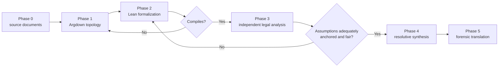

# Auditing Legal Reasoning with Lean 4: A Six-Phase Pipeline for Brazilian Civil Procedure Using Argdown and Formal Verification

**Franklin Silveira Baldo**  
Independent Researcher

> **Revision note.** This archival version incorporates the claim-specific prior-art and correctness audit in `audits/prior-art/pipeline-lean-argdown-2026-09-18.md`. Earlier drafts incorrectly described TAIR as imposing an acyclicity gate on legal argument graphs and treated acyclicity as a general requirement of argumentation frameworks. Both claims are withdrawn. Dung-style frameworks can contain cycles, including cycles that arise naturally in legal disputes. Lean's support for recursive definitions likewise does not license circular proof justification. The contribution defended here is narrower: a traceability contract across complementary audit surfaces — Argdown topology, Lean consequence and axiom-dependency inspection, independent legal review of the assumptions, defeat synthesis, and forensic translation.

## Abstract

We present a six-phase methodology for auditing procedural legal arguments in Brazilian civil procedure using Argdown as an upstream representation of argumentative topology and Lean 4 as an assumption-and-consequence audit layer. The method deliberately separates three questions that earlier versions of this paper conflated: **(i)** what attacks and supports what; **(ii)** what follows deductively from explicitly declared legal and factual assumptions; and **(iii)** whether those assumptions fairly represent the governing sources and the record. Argdown and argumentation frameworks address the first surface; Lean compilation plus `#print axioms` address the second; an independent substantive legal-analysis gate addresses the third. Successful Lean compilation is therefore necessary for a claimed formal derivation but never sufficient for a legal conclusion.

The six phases are: source-document collection, Argdown decomposition, Lean formalization, independent legal assessment with loop-back, resolutive synthesis, and forensic translation. We demonstrate the workflow on a Brazilian civil-procedure case and pin the corresponding open-source implementation. The paper does **not** claim that proof assistants replace defeasible argumentation, that argumentation frameworks require acyclicity, or that a compiled theorem proves its premises legally correct. Its candidate contribution is the integrated traceability contract from source-level argument to theorem, transitive assumption ledger, substantive premise review, resolution record, and final pleading.

**Keywords**: legal reasoning; formal verification; Lean 4; Argdown; Brazilian civil procedure; binding precedent; argumentation; AI & Law; auditability.

## 1. Introduction

Legal reasoning systems face at least three distinct verification problems. First, they must represent the dialectical structure of a dispute: which claims support, attack, undercut, or qualify other claims. Second, when a system states that a conclusion follows from a set of premises, that entailment should be mechanically inspectable. Third, no proof checker can decide by type checking alone whether the encoded premises are faithful to the law, the evidentiary record, the procedural posture, or the authority structure of the legal system.

These problems have substantial prior art. Abstract and structured argumentation frameworks provide formal tools for attacks, supports, preferences, burdens, and competing extensions (Dung 1995; Prakken 2010; Gordon, Prakken & Walton 2007). Cycles are not an anomaly excluded by the framework: they have a dedicated formal literature, and legal argumentation supplies natural examples of even-length cycles representing live disputes (Bench-Capon 2014, 2020). Proof-assistant and formal-language work has also long addressed substantive legal material. LogiKEy uses Isabelle/HOL to evaluate value-oriented legal reasoning (Benzmüller, Fuenmayor & Lomfeld 2021), while Catala provides an executable formal language for statutory computations and verifies compiler components with F* (Merigoux, Chataing & Protzenko 2021). More recent neuro-symbolic legal systems combine language models, role separation, formalization, solver checks, and iterative repair; L4M is a direct pre-cutoff example of that broader staged pattern (Chen et al. 2025). TAIR likewise separates evidence construction, structural checks, and domain-sensitive assessment rather than reducing legal verification to a proof-checking endpoint (Bowers & Ludäscher 2026).

This paper therefore does not claim a binary choice between argumentation frameworks and proof assistants. It proposes an integration in which each mechanism is assigned a narrower audit surface.

The workflow begins with source documents and an Argdown representation. Material attacks are then translated into Lean theorems over named legal and factual assumptions. Lean compilation checks formal consequence, while `#print axioms` exposes the transitive assumptions on which each theorem depends. A separate legal analyst reviews whether those assumptions are adequately sourced, procedurally relevant, and fairly formulated. Only after that gate may the formal result be used in a resolutive synthesis. The final phase translates the accepted structure back into ordinary forensic prose.

The claim-specific temporal audit reconstructed public precursors in the author's own implementation repository before the paper itself: the legal use of Lean's axiom-dependency audit was public by 8 May 2026, a staged workflow with an independent substantive gate by 9 May, and the exact Argdown-based six-phase wiring by 10 May. Those dates matter for provenance but do not turn standard Lean or Argdown capabilities into novel primitives. The strongest residual claim is the complete integration-specific traceability contract.

### 1.1 Contributions and non-claims

This paper makes four bounded contributions:

1. **A six-phase traceability workflow** connecting source documents, Argdown topology, Lean formalization, substantive legal review, defeat synthesis, and forensic translation.
2. **A per-theorem assumption ledger** in which `#print axioms` is used to expose which statutes, precedents, record facts, and systemic assumptions are load-bearing for each formal conclusion.
3. **A dual-gate discipline**: compilation checks consequence under declared assumptions; an independent legal-analysis gate checks whether those assumptions fairly encode law and record.
4. **A pinned Brazilian civil-procedure implementation and worked case**, allowing the method to be inspected as an engineering artifact rather than only as prose.

The paper does not claim invention of Argdown, argumentation frameworks, theorem proving, `#print axioms`, staged neuro-symbolic legal reasoning, or formalization of law. It does not claim that cycles make argumentation frameworks unsuitable for law. It does not claim that Lean can justify a theorem through arbitrary circular dependency. Finally, the legal taxonomies encoded in the worked library are inputs to be audited, not legal truths established merely because the corresponding Lean files compile.

## 2. Background and prior work

### 2.1 Argumentation frameworks and cycles

Dung's abstract argumentation frameworks model arguments as nodes connected by attacks and evaluate acceptable sets under semantics such as grounded, preferred, complete, and stable semantics (Dung 1995). Structured approaches such as ASPIC+ preserve the internal premises and rules used to construct arguments (Prakken 2010), while Carneades models argument structure and burdens of proof (Gordon, Prakken & Walton 2007). Bipolar argumentation frameworks additionally represent support relations (Cayrol & Lagasquie-Schiex 2005).

Nothing in this lineage supports the earlier version of this paper's blanket claim that argumentation frameworks require acyclicity. Bench-Capon (2014) analyzes even and odd cycles directly in Dung-style frameworks. Bench-Capon's later review of AI & Law gives legal examples in which cycles arise from opposed arguments and notes that even-length cycles are close to unavoidable when modeling live legal disputes (Bench-Capon 2020). Cycles are therefore a semantic object to be handled, not a general structural defect to be eliminated.

Argdown is used here as a human-readable representation layer for claims, arguments, attacks, supports, and metadata. Its syntax and tooling predate this work. The contribution claimed here is only its role inside the full audit chain.

### 2.2 Formal methods and legal reasoning

Formal legal reasoning also predates this pipeline. LogiKEy embeds legal and ethical reasoning in higher-order logic and uses Isabelle/HOL as a framework for evaluating formalized legal theories (Benzmüller, Fuenmayor & Lomfeld 2021). Catala targets statutory law that can be represented as executable computation and combines a lawyer-readable language with compiler verification (Merigoux, Chataing & Protzenko 2021). These works are direct reasons not to describe proof assistants or formal languages as confined to mathematical subproblems.

The relevant limitation is different. A theorem prover can establish consequence inside the formalization it receives. It does not thereby certify that a legal proposition was encoded at the right level of generality, that a cited authority governs the case, that a factual assumption is supported by the record, or that a procedural inference is legally available. Formal validity and legal adequacy are related but non-identical audit questions.

### 2.3 Staged and neuro-symbolic legal pipelines

The generic idea of decomposing legal work into language-model roles plus formal or structured verification is also occupied. TAIR proposes domain-dependent evidence structures and verification stages; in its legal branch it constructs and checks a bipolar argumentation structure and then applies argumentation semantics. The primary TAIR source does not establish the acyclicity gate attributed to it in earlier drafts of this paper (Bowers & Ludäscher 2026).

L4M combines adversarially separated language-model roles with autoformalization, SMT-backed checking, unsat-core feedback, iterative repair, and a final language-model judge (Chen et al. 2025). Related pre-cutoff work likewise explores intermediate verification and logic-based legal reasoning. Consequently, the present paper does not assign novelty to multi-stage verification, role separation, or neuro-symbolic legal reasoning in isolation.

The narrower design choice here is to use Lean not as an autonomous legal adjudicator but as a transparent dependency checker inside a larger workflow, then subject its legal and factual assumptions to a distinct substantive gate.

## 3. Three complementary audit surfaces

### 3.1 Dialectical topology: Argdown and argumentation analysis

The first audit surface asks how the dispute is organized. Which proposition is attacked? Which evidence supports it? Which counterargument undercuts a warrant rather than merely rebutting a conclusion? Are there mutually attacking positions or unresolved branches?

Argdown is well suited to exposing this topology in a human-readable artifact. Argumentation semantics can additionally analyze competing positions. This surface is not replaced by Lean: a theorem prover need not represent the dialectical status of every alternative argument simply because it can prove a proposition from a selected premise set.

### 3.2 Formal consequence and the assumption boundary: Lean 4

The second audit surface asks a narrower question: given an explicit formalization, does the claimed conclusion follow? Lean checks the term and its types. `#print axioms` then reports the axioms on which a theorem depends directly or transitively. The command is a standard Lean capability; its use here is operational rather than an invention of the command itself.

For legal auditing, the transitive list is useful because named assumptions can be aligned with provenance: a statute, a precedent proposition, a record fact, or an explicit systemic presupposition. Comparing the axiom sets of multiple theorems can reveal which authorities or factual assumptions are load-bearing across several argumentative paths.

This should not be overstated. Lean's controlled mechanisms for recursion and inductive definitions are not permission for theorem A to justify theorem B while theorem B justifies theorem A without a sound construction. Earlier versions used mutual recursion as an analogy for legal circularity; that analogy is withdrawn. The method needs no such claim. Its formal value comes from checked consequence and transparent assumptions.

### 3.3 Substantive adequacy: the independent legal-analysis gate

The third audit surface asks whether the assumptions deserve to be used. For each central assumption, the reviewer assesses at least:

- **documentary anchoring** — is it actually supported by an authoritative source or the record?
- **legal scope** — does the cited norm or precedent govern this procedural and factual posture?
- **counterargument engagement** — is there an equally strong qualification or adverse authority that the formalization omitted?
- **fair formulation** — would a competent opposing lawyer recognize the formalized proposition as a plausible statement of the position rather than a straw man?
- **competence and remedy** — even if a proposition is persuasive, is the relevant court legally empowered to take the action encoded by the model?

A theorem that compiles but fails this review returns to formalization. This is the core epistemic separation: **Lean verifies consequence under assumptions; the legal gate audits the assumptions.** Neither substitutes for the other.

### 3.4 The integration-specific traceability contract

The distinctive object of the pipeline is the cross-surface chain:

`source locator → Argdown claim/attack → Lean theorem → #print axioms ledger → legal adequacy review → resolutive status → forensic proposition`.

A material conclusion is promoted only when its path remains inspectable across those representations. The claim-specific prior-art audit found substantial antecedents for every individual ingredient and for generic staged formal legal systems, but did not locate a pre-cutoff legal workflow combining all seven links of this particular chain. That is a bounded search result, not an exhaustive firstness claim.

## 4. The six-phase pipeline

### 4.1 Overview



The pipeline separates formal derivability from substantive acceptance. Compilation is a gate on the formal claim; legal analysis is a gate on the premise model; resolutive synthesis is a record of what survives both.

### 4.2 Phase 0: source documents

The workflow begins from an explicit source set. Courts, statutes, precedents, pleadings, and evidentiary records are collected before formalization. Every later material assumption should point back to a source locator or be marked as an inference/systemic assumption rather than silently presented as documentary fact.

### 4.3 Phase 1: Argdown decomposition

The formalizer represents the dispute as claims and arguments. Attack and support relations capture dialectical structure, while metadata records provenance and epistemic status.

```argdown
[Servidora exerce função de magistério]
  #necessary #judgment
  - <P1 — ressalva do precedente>: o precedente transcrito contém
    qualificação que precisa ser enfrentada para sustentar a conclusão.
  - <P2 — aderência normativa>: o contexto constitucional do precedente
    deve ser comparado ao contexto do caso antes de sua transposição.
```

The tags are descriptive metadata for the audit. They do not make a proposition legally necessary or true by declaration.

### 4.4 Phase 2: Lean formalization

Material attacks are translated into Lean propositions over named assumptions. The implementation uses a modular library for case facts, procedural categories, precedent relations, and provenance. Each material theorem corresponds to an identified attack or inference in the Argdown artifact.

A hard rule applies: failed compilation is diagnostic. The formalizer must not change facts or legal assumptions merely to make a desired theorem compile. If the intended reasoning cannot be represented without introducing a new premise, that premise must become explicit and auditable.

For every material theorem, the workflow records `#print axioms`. This turns hidden dependencies into an inspectable ledger.

### 4.5 Phase 3: independent substantive legal analysis

The analyst receives the Argdown, compiled Lean file, assumption ledger, and source documents. The role is deliberately separated from the formalizer when practicable. The analyst can block promotion of a theorem even when it compiles, for example because a premise overstates a precedent, a factual assumption is only inferential, or a remedy lies outside the court's competence.

This stage is not an oracle either. Its judgments remain reviewable legal analysis. Its purpose is to prevent the formal checker from being mistaken for a source of substantive authority.

### 4.6 Phase 4: resolutive synthesis

The synthesis records which claims survive and why. A promoted defeat or objection should reference both the formal theorem and the substantive review that accepted the relevant assumptions. This gives the reviewer two independent inspection points: derivability and premise quality.

### 4.7 Phase 5: forensic translation

The final pleading or memorandum uses ordinary legal language rather than workspace ontology. Internal labels such as theorem names, graph nodes, or provisional category names should not replace recognized procedural concepts. Formal artifacts remain provenance behind the prose, not prose substitutes.

### 4.8 Reproducibility boundary

The implementation supporting this archival version is pinned to `franklinbaldo/skills` commit `080cfb435d38162470ba4abb0d3cbb44e7b86d05`. Relevant paths include:

- `legal-argument-lean/SKILL.md`;
- `legal-argument-lean/pipeline/02_briefing_lean.md`;
- `legal-argument-lean/pipeline/exemplo_marilene/`;
- `legal-argument-lean/references/libraries-and-audit.md`.

The worked example's Lean file is `legal-argument-lean/pipeline/exemplo_marilene/02_lean_fase2.lean`, which includes explicit compilation instructions and named attack theorems. This pin fixes the implementation evidence used by this paper; later changes in `franklinbaldo/skills` are not silently inherited by this version.

## 5. Brazilian civil-procedure library: what compilation does and does not establish

The implementation contains reusable types and predicates for decisions, precedents, claims, appellate requests, provenance, and CPC-related reasoning. The library is useful as an engineering substrate, but compilation establishes only consequences of the encoded definitions and assumptions. It does not independently establish that a taxonomic choice is the uniquely correct statement of Brazilian procedural law.

### 5.1 Precedent-response taxonomy

The May 2026 implementation contains predicates with names such as `AplicaCorretamente`, `DistingueCorretamente`, `SuperaPlenamente`, `ReconheceSuperacaoExterna`, and `SuperaRacionalmente`. Earlier drafts of this paper presented the resulting five-branch theorem as a new general legal theorem and suggested too broadly that lower courts could rationally supersede binding STF precedent.

That framing is not retained here. The code is a historical implementation snapshot used to expose argumentative commitments. Any legal use of its branches must remain competence-sensitive: application and distinction are different from formal revision or cancellation by the competent source court; criticism or signaling does not itself create a power to overrule; and any legally available nonapplication must be justified within the governing procedural regime. A later companion dogmatic paper in this repository develops a narrower taxonomy and should be consulted for the legal claim rather than treating the Lean constructor names as doctrine.

### 5.2 Embargos de Declaração and outcome modification

The library also encodes the proposition that curing a declaratory defect may entail modification of the outcome rather than requiring a separate autonomous request for reform. This paper does not claim that proposition as an original discovery. The current CPC expressly contemplates the possibility of modification in art. 1.024, §4º, and the repository's companion dogmatic paper treats the earlier doctrinal and jurisprudential lineage separately.

The formal predicate is therefore best read as an encoding used by the audit pipeline, not as evidence of doctrinal priority.

### 5.3 Provenance and unresolved status

The `Proveniencia` and `StatusClaim` types include a `pendente` constructor. This is an engineering choice that prevents unresolved provenance from being silently promoted to certainty. When a theorem depends on an assumption whose source status is pending, the dependency remains visible in the theorem's assumption ledger and should be treated accordingly by Phase 3.

## 6. Worked case: Apelação 7003561-54.2024.8.22.0010

The repository includes a worked audit of a TJRO decision concerning a public servant, a precedent invoked by the judgment, and procedural objections raised by IPERON. The purpose of this section is methodological: to show how an argument travels through the audit chain. It is not a claim that Lean independently adjudicated the dispute.

### 6.1 From source text to attacks

The Argdown artifact separates, among other issues, the judgment's use of the precedent, an express qualification in the precedent text, the constitutional context in which the precedent arose, and an additional argument based on a TCE-RO source. These become separately reviewable attacks instead of one undifferentiated assertion that the judgment is wrong.

### 6.2 From attacks to Lean theorems

The pinned example contains named theorems corresponding to the main attacks. Compilation shows that the conclusions follow from the encoded premises. `#print axioms` identifies which case facts, precedent propositions, and systemic assumptions each theorem uses.

One theorem, for example, derives a contradiction from the combination of the precedent qualification, the encoded appointment fact, and the judgment's encoded conclusion. Another models a failure to engage an independent argument. A further theorem uses the library's precedent-response predicates. The last example is precisely where the independent legal gate matters most: the code can establish a consequence from its taxonomy, but Phase 3 must still assess whether that taxonomy and its competence assumptions accurately state the governing law.

### 6.3 What the case study demonstrates

The demonstrated result is therefore **traceability**, not autonomous legal truth. A reviewer can identify:

1. the source-level proposition;
2. its place in the argument graph;
3. the formal theorem that uses it;
4. the assumptions transitively required by the theorem;
5. the substantive review of those assumptions; and
6. the final forensic proposition supported by the accepted chain.

This makes disagreement more local. A reviewer can contest the source reading, the formalization, the legal scope, or the conclusion without having to accept or reject the whole pipeline as one opaque unit.

## 7. Positioning relative to the closest antecedents

### 7.1 Argumentation frameworks

Argumentation frameworks provide semantics for contested positions and can represent cycles. The present workflow uses Argdown/argumentation analysis for that dialectical role. Lean is not proposed as a replacement semantics for Dung-style frameworks.

### 7.2 LogiKEy and Catala

LogiKEy demonstrates substantive legal reasoning inside a proof-assistant environment, while Catala demonstrates how legal rules can be translated into an executable formal language with verified compiler components. These occupy the broad proposition that formal methods can make legal reasoning or legal computation inspectable. The narrower distinction here is the per-attack assumption ledger plus a post-compilation legal adequacy gate connected to an argumentative topology and final forensic artifact.

### 7.3 TAIR

TAIR is a close methodological neighbor because it separates evidence construction, verification, and domain-sensitive assessment. Earlier versions of this paper mischaracterized TAIR as verifying legal BAFs by an acyclicity condition. That statement is withdrawn. The relevant contrast is narrower: TAIR's legal branch uses evidence/argument structures and argumentation-oriented checks, whereas this pipeline additionally maps material legal attacks into Lean theorems and uses the theorem's transitive axiom set as an explicit burden/dependency ledger before independent legal review.

### 7.4 L4M and staged neuro-symbolic legal reasoning

L4M predates the public cutoff for this paper's exact Argdown pipeline and already combines separated LLM roles, formalization, solver-backed checking, iterative correction, and final natural-language adjudication. It is prior art for the generic staged neuro-symbolic architecture. The present residual claim must therefore remain implementation-specific: Argdown topology → one Lean theorem per material attack → `#print axioms` dependency ledger → legal fairness/provenance gate → cross-referenced defeat synthesis → Brazilian forensic translation.

## 8. Limitations

The pipeline has several important limitations.

**Formalization risk.** A clean theorem can encode a bad legal premise. The separate gate reduces but cannot eliminate that risk.

**Reviewer dependence.** Phase 3 remains substantive legal judgment. Role separation and provenance improve auditability, not infallibility.

**Taxonomy drift.** Legal categories in the implementation can become outdated or overbroad. Pinning the implementation revision prevents silent drift but does not make the pinned taxonomy correct forever.

**Source completeness.** Missing pleadings, authorities, or factual records can produce an apparently coherent audit over an incomplete universe of evidence.

**No general superiority claim.** The workflow does not establish that Lean is superior to argumentation frameworks. It assigns them different roles and claims that the combination can expose more kinds of disagreement than either layer alone in this use case.

**Bounded novelty.** The prior-art search is claim-specific and non-exhaustive. The contribution is the integrated audit contract found at the stated cutoff, not firstness of its individual ingredients.

## 9. Conclusion

This paper presents a six-phase legal-audit pipeline built around a separation of concerns. Argdown represents dialectical topology. Lean verifies formal consequence under explicit assumptions and exposes transitive dependencies through `#print axioms`. An independent legal-analysis gate asks whether those assumptions are actually warranted by law and record. Resolutive synthesis records what survives both checks, and forensic translation returns the result to ordinary legal practice.

The archival contribution is deliberately narrower than in earlier drafts. Argumentation frameworks do not generally require acyclicity; legal AFs can contain cycles. TAIR should not be described as imposing an acyclicity gate on its legal branch. Lean recursion is not a license for circular proof justification. Formal legal reasoning, staged verification, and proof-assistant use in law all have substantial antecedents.

What remains is an inspectable integration: `source → Argdown → Lean theorem → axiom ledger → independent legal review → synthesis → pleading`, implemented for Brazilian civil procedure and pinned to an exact public revision. The value of the method is not that formalization settles law, but that it makes the route from source to conclusion easier to challenge at the correct layer.

## References

- Bench-Capon, T. J. M. (2014). Dilemmas and paradoxes: cycles in argumentation frameworks. *Journal of Logic and Computation*, 26(4), 1055–1064. https://doi.org/10.1093/logcom/exu011
- Bench-Capon, T. J. M. (2020). Before and after Dung: Argumentation in AI and Law. *Argument & Computation*, 11(1–2), 221–238. https://doi.org/10.3233/AAC-190477
- Benzmüller, C., Fuenmayor, D., & Lomfeld, B. (2021). Value-oriented legal argumentation in Isabelle/HOL. In *ITP 2021*. https://doi.org/10.4230/LIPIcs.ITP.2021.7
- Bowers, J., & Ludäscher, B. (2026). Towards Trustworthy AI Results using Evidence Structures. *AI4EVIR@JURIX 2025, CEUR Workshop Proceedings 4157*. https://ceur-ws.org/Vol-4157/paper6.pdf
- Cayrol, C., & Lagasquie-Schiex, M.-C. (2005). On the acceptability of arguments in bipolar argumentation frameworks. *ECSQARU 2005*.
- Chen, L., Cai, Y., Hou, Z., & Dong, J. (2025). Towards Trustworthy Legal AI through LLM Agents and Formal Reasoning. arXiv:2511.21033. https://arxiv.org/abs/2511.21033
- Dung, P. M. (1995). On the acceptability of arguments and its fundamental role in nonmonotonic reasoning, logic programming and n-person games. *Artificial Intelligence*, 77(2), 321–357.
- Gordon, T. F., Prakken, H., & Walton, D. (2007). The Carneades model of argument and burden of proof. *Artificial Intelligence*, 171(10–15), 875–896.
- Lean project. *Theorem Proving in Lean / Reference Manual: Axioms and `#print axioms`*. https://lean-lang.org/doc/reference/latest/Axioms/
- Merigoux, D., Chataing, N., & Protzenko, J. (2021). Catala: a programming language for the law. *Proceedings of the ACM on Programming Languages*, 5(ICFP), Article 77. https://doi.org/10.1145/3473582
- Prakken, H. (2010). An abstract framework for argumentation with structured arguments. *Argument & Computation*, 1(2), 93–124.
- Toulmin, S. (1958). *The Uses of Argument*. Cambridge University Press.
- Voigt, C. et al. (2018–). Argdown. https://argdown.org/

## Reproducibility and archival provenance

Canonical implementation revision for this paper: `franklinbaldo/skills@080cfb435d38162470ba4abb0d3cbb44e7b86d05`.

Claim-specific prior-art/correctness audit: `audits/prior-art/pipeline-lean-argdown-2026-09-18.md`.

The Zenodo preparation workflow records the exact `franklinbaldo/papers` source commit and bundle hashes at packaging time; those generated values, rather than this prose, are the canonical provenance for the deposited artifact.
