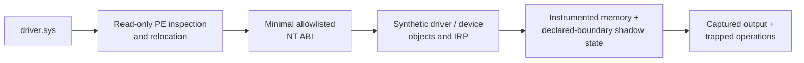
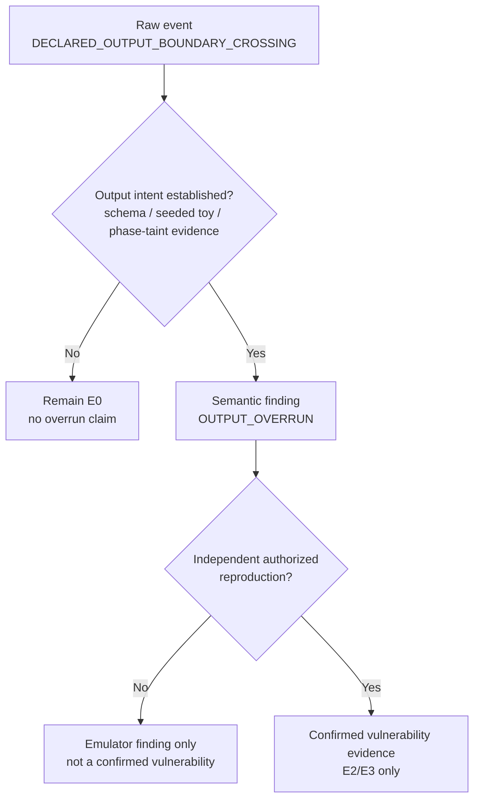

# Contract-Aware Shadow Checking for User-Mode Windows Driver Rehosting

> **Position and methodology paper — frozen v0.1.** LiteBox capability
> brokering and two read-only Windows backends were demonstrated on unmerged
> draft commit [`a74e5e2`](https://github.com/franklinbaldo/litebox/commit/a74e5e2d132a1981c6a5934e722000f07692526c).
> The later M1–M7 rehosting implementation remains an open, unmerged scaffold in
> LiteBox PR #24 (head `b8b5fd0fdf58f782ba84a48aadb406a260b541a3` as inspected for this freeze),
> based on LiteBox main `7af6242f0729c1f0224161c7cec0afc114994cf6`.
> Windows `.sys` loading, the synthetic NT ABI, calibrated shadow checking,
> containment, and third-party evaluation therefore remain proposed or
> unvalidated. This paper reports no driver vulnerability. A claim-specific
> prior-art audit is frozen at
> [`audits/prior-art/contract-aware-driver-rehosting-2026-09-17.md`](audits/prior-art/contract-aware-driver-rehosting-2026-09-17.md).

## Abstract

Privilege is often modeled as a scalar: a process either gains authorization or
it does not. Program rehosting exposes a second axis. A non-administrative
Windows process that rehosts selected driver logic retains the same host token,
yet may lower the cost of relocation, synthetic requests, memory tracing, and
process-local fuzzing. We call the invariant authorization boundary the
**privilege ceiling** and the set of research actions affordable under an
explicit resource budget the **researcher affordance floor**. This usage follows
the repository's [affordance-restriction framework](affordance_restriction.md);
it is intentionally distinct from LiteBox's capability-based access registry.

The primary technical proposal is a fixture-driven SystemBuffer Shadow Checker
for synthetic `METHOD_BUFFERED` requests. Prior work already establishes the
component ideas of logical/sub-object bounds inside a larger valid allocation
(AddressSanitizer contiguous-container annotations; EffectiveSan), the Windows
buffered-I/O contract itself, and user-mode/emulated Windows driver analysis
(x64dbg/`driver_unpacking`; Mandiant Speakeasy). The candidate contribution is
therefore narrower: a Windows-specific combination that tracks both the physical
`max(InputBufferLength, OutputBufferLength)` allocation and the caller-declared
`OutputBufferLength`, emits a raw event when a write crosses only the latter,
refuses to promote that event to an output overrun without independent output-
intent evidence, requires benign shared-buffer negative controls, and separates
fixture calibration from vulnerability confirmation.

Because `SystemBuffer` contains both input and output, a declared-boundary
crossing is an E0 sensor event, not automatically a Windows-contract violation.
Promotion to `OUTPUT_OVERRUN` requires an IOCTL-specific schema, source-known
toy, phase/taint evidence, or an equivalent basis for output intent. By
contrast, `IoStatus.Information > OutputBufferLength` is a distinct invalid-
completion event. The trace checker is specified as independently exercisable
over typed fixtures, decoupled from broad `.sys` compatibility.

A PE loader, minimal NT ABI, instrumented allocator, explicit IRQL state,
isolation, calibration, abandonment, and coordinated-disclosure gates support
that sensor. The paper does not claim that rehosting reproduces Windows or
eliminates VMs for hostile targets. Toys written by the researcher may support
local iteration; third-party native code requires a disposable VM unless a
stronger boundary is demonstrated.

## 1. Privilege ceiling and affordance cost

Let `A` be a preregistered set of research actions, such as relocating a PE,
dispatching one request, recovering from a fault, and reproducing a finding.
For workflow `w`, measure each action with the cost vector
`cost_w(a) = (operator time, machine time, privileged steps, resets, hardware,
uncontained failures)`. Given an explicit budget vector `B`, define
`F_w(B) = {a in A | cost_w(a) <= B}`, where comparison is componentwise and the
units and normalization of every component are frozen before measurement. The
**researcher affordance floor** is this measured set, not a mathematical minimum
and not an authorization primitive.

Authorization is not collapsed into one workflow scalar. Each run records
`P_w = (host token, guest token, privileged setup steps, kernel execution)`.
The rehosting claim is that the host token is not expanded by loading the
harness or selecting a broker. It does **not** assume
`P_rehost = P_baseline`: a native VM baseline may require guest administration
and kernel execution even when the host identity is unchanged. The falsifiable
cost hypothesis is narrower: conditional on the recorded authorization tuple,
`F_rehost(B)` strictly contains `F_baseline(B)` for at least one preregistered
budget. Failure to observe that difference rejects the affordability claim.

Invoking `.sys` code grants no ring-0 execution, DMA, interrupts, physical
memory, or arbitrary device handles. Removing installation, hardware, recovery,
and instrumentation costs can nevertheless broaden defensive participation. It
can also lower the cost of finding defects whose exploitation might later
attack an unchanged privilege ceiling. Affordance must therefore grow together
with evidentiary discipline and containment.

## 2. Demonstrated substrate versus proposed artifact

The substrate is an unmerged LiteBox fork draft that runs rewritten Linux ELF
programs in a Windows user-mode process. It adds a capability registry, profiles
(`none`, `safe`, `host`), explicit selection, and fail-closed rejection of
unavailable capabilities. CPU, SIMD, memory, clocks, and threads are inherent;
brokered resources require policy.

Two read-only brokers were demonstrated on draft commit `a74e5e2`:
`hostinfo` returns architecture and logical-processor data, and `power` queries
AC/battery state through the Windows power stack. An ELF toy also executed
`CPUID`, `RDTSC`, and `RDRAND` with brokered hardware set to `none`. These
results demonstrate policy-controlled brokering and direct CPU instructions.
They do not demonstrate `.sys` rehosting, device passthrough, hostile-code
isolation, or vulnerability discovery.

The proposed execution pipeline is:



**Figure 1.** *Proposed transformation boundary. The frozen evidence supports
the LiteBox substrate only; `.sys` loading, the synthetic ABI, and calibrated
shadow checking remain gated artifacts.*

Every boundary has a typed, serializable fixture so that each module can be
exercised without the previous stage:

| Module | Fixture | Sole evidence authority |
|---|---|---|
| M1 PE loader | raw `.sys` bytes | parsed/relocated image or structural rejection |
| M2 import resolver | import-table record | resolved, unsupported, or trapped import |
| M3 synthetic NT | `DriverEntry` plus one IOCTL fixture | deterministic status and output |
| M4 allocator | allocation/free/access trace | spatial or temporal memory event |
| M5 shadow checker | lengths, write intervals, completion record | declared-boundary, physical-overflow, and completion events |
| M6 IRQL model | transition and access sequence | IRQL contract event |
| M7 isolation | payload plus resource policy | contained exit and structured log |

M5 is therefore specified as a standalone pure sensor over a trace. Its seeded
and negative cases require no PE and no hostile code. M7 gates any module that
executes real native code; M1–M6 can still be reviewed against synthetic
fixtures. This decomposition is tracked by LiteBox issue #16 and children
#17–#23 [21]. The current implementation PR #24 is an unvalidated scaffold, not
evidence that these contracts have been met [22].

Unresolved imports and external effects fail closed. The first executable target
is written specifically for calibration. Third-party binaries remain excluded
until the gate in Section 7 passes.

## 3. Minimal synthetic NT model

This is not an NT-kernel emulator. It freezes one small, single-threaded toy
contract:

- PE relocation and an allowlisted entry point;
- synthetic driver and device objects;
- `DriverEntry` and one device-control dispatch routine;
- bounded allocation, free, logging, creation, and completion stubs;
- one buffered IOCTL;
- no PnP, WMI, cancellation, DPC, DMA, interrupts, direct I/O, or
  `METHOD_NEITHER`.

Unknown behavior produces `UNSUPPORTED` or `TRAPPED_OPERATION`; it is never
approximated silently.

### 3.1 Explicit IRQL state

The toy keeps an emulated current IRQL, starts supported dispatch at a documented
fixed level, and records modeled transitions. Paged-pool access at an
incompatible level becomes a contract event rather than succeeding because
user-mode memory happens to be resident. This does not reproduce scheduling,
interrupts, cancellation, or multiprocessor interleavings. Findings depending
on them are out of scope; paths requiring them create known false negatives.

### 3.2 Instrumented allocation

Pool stubs track address, requested size, tag, state, and available call site.
Redzones and guard pages detect spatial errors where practical. Distinct poison
patterns expose uninitialized and stale accesses. A bounded free quarantine
makes use-after-free and double-free observable. This instrumentation is a
sensor, not containment; crashes and loops require a separate process boundary.

## 4. The SystemBuffer Shadow Checker

For a synthetic `METHOD_BUFFERED` request, the modeled I/O manager allocates
`N = max(InputBufferLength, OutputBufferLength)`, copies bounded input into
`SystemBuffer`, invokes dispatch, and models bounded copy-back. Physical bounds
and the declared caller-output boundary are different. With input length 64 and
output length 8, a 32-byte write may remain inside the allocation while crossing
the declared output boundary. A trailing guard page alone cannot observe that
crossing [3, 4].

The two bounds answer different questions. The physical allocation answers
whether the write is memory-safe in the synthetic buffer; the caller-declared
output length answers whether the write crosses the API-declared output extent.
The example below shows why those predicates can disagree without yet proving
an overrun.

```mermaid
flowchart LR
    I[InputBufferLength = 64] --> N[SystemBuffer allocation<br/>N = max(input, output) = 64]
    O[OutputBufferLength = 8] --> N
    W[Observed write<br/>interval 0..32] --> P{Within physical allocation<br/>0..64?}
    P -- No --> F[PHYSICAL_OVERFLOW]
    P -- Yes --> D{Within declared output<br/>0..8?}
    D -- Yes --> K[Within both bounds]
    D -- No --> E[DECLARED_OUTPUT_BOUNDARY_CROSSING<br/>E0 sensor event]
    N --> P
```

A guard page can detect the `PHYSICAL_OVERFLOW` branch, but not the E0 branch;
promotion of E0 to `OUTPUT_OVERRUN` still requires the independent output-intent
evidence described below.

The broad idea of enforcing a logical or sub-object bound inside a larger valid
allocation is **not** new. AddressSanitizer contiguous-container annotations can
poison the unused tail between a vector's logical end and capacity while the
storage remains allocated [25], and EffectiveSan instruments sub-object bounds
inside enclosing objects [26]. The Windows contract itself is likewise
established: Microsoft documents the shared `SystemBuffer`, distinct input and
output lengths, and allocation to the larger length [3]. The candidate
contribution here is the operation-specific combination of that Windows dual
bound with an ambiguity-aware promotion rule: a crossing of the output-length
boundary is separately observable but is not called an output violation until
independent evidence establishes the semantic role of the write.

The checker records every write interval `W_i = [o_i, o_i + s_i)` using checked
arithmetic and computes `H = max_i(o_i + s_i)`. It emits three distinct raw
events:

- `DECLARED_OUTPUT_BOUNDARY_CROSSING` when
  `H > OutputBufferLength` but `H <= N`;
- `PHYSICAL_OVERFLOW` when any interval exceeds `N`; and
- `INVALID_COMPLETION_LENGTH` when
  `IoStatus.Information > OutputBufferLength`.

The first event is intentionally E0. Its name describes only what the sensor
knows: a write crossed the caller-declared output-length boundary while
remaining inside the shared allocation. Microsoft documents that `SystemBuffer`
represents both input and output and is allocated to the larger length; those
facts do not by themselves prove that every write in the consumed-input tail is
an output overrun. Promotion to `OUTPUT_OVERRUN` requires an IOCTL-specific
output schema, a source-known seeded toy, or phase/taint evidence that the write
was intended as output. A benign scratch/input-tail fixture is a mandatory
negative control. `INVALID_COMPLETION_LENGTH` remains an objective completion
contract event because the I/O manager trusts `Information` when copying back
[3, 4, 20].

The evidence ladder is deliberately asymmetric: the sensor may emit a raw
crossing cheaply, but every stronger label requires an additional independent
evidentiary gate.



Events include IOCTL, input/output lengths, every offending interval, physical
bound, high-water mark, completion length, operation phase, and available
write-site trace. Harness bookkeeping failures are a fourth, internal evidence
class. Any operation-specific policy must be explicit, narrow, hash- and
IOCTL-bound, documented, and visible in output—never silently suppressed.

Microsoft's current Driver Verifier configuration exposes I/O Verification;
Enhanced I/O Verification has been subsumed into it since Windows 7 [19]. The
documentation does not guarantee classification of this exact declared-boundary-
within-allocation signal. Whether Driver Verifier reports the same seeded,
output-intent-confirmed violation is therefore a controlled baseline question,
not an assumed advantage of this checker.

## 5. Threat model and isolation

A `.sys` remains hostile native code outside the kernel. It may corrupt its
process, loop, jump unexpectedly, or attack the emulated ABI. It must not run in
the main launcher. A disposable child is the first candidate boundary, but
subprocess, translated execution, or another mechanism remains an explicit
design decision in M7. Whatever boundary is selected must enforce copied and
bounded inputs, process-tree termination, time/memory/output limits,
deterministic cleanup, and structured operation logs. Job objects, restricted
tokens, process mitigations, and AppContainer may reduce exposure without
admin; they do not automatically form a VM-strength boundary. Unsupported
platform limits fail closed. Code still executes under an identity derived from
the current user.

The PE loader, pointer translation, integer arithmetic, object lifetimes, import
registry, and event serialization all process hostile input. `--hardware none`
requires external effects to be rejected or simulated; it does not make native
code harmless.

Two execution regimes keep the cost claim honest. A purpose-built toy, whose
source and build are controlled by the researchers, may run locally in the
disposable child after ordinary review. Any third-party `.sys` runs only in a
disposable VM without personal credentials or unrelated user data, with network
access disabled unless the protocol requires it. Rehosting may remove repeated
guest crash/reboot cycles; it does not remove the VM requirement for hostile
native code.

The initial experiment forbids driver installation, SCM registration, physical
memory, port I/O, DMA, interrupts, and arbitrary `DeviceIoControl` relay. Any
future physical effect must cross a typed, policy-checked capability backend.

## 6. Evaluation design

The empirical question is whether rehosting changes research cost while
producing calibrated evidence.

- **RQ1:** Conditional on the recorded host/guest authorization tuple, which
  actions become affordable, and how do setup, recovery, throughput, privileged
  steps, resets, and uncontained failures compare across local-toy and
  disposable-VM workflows?
- **RQ2:** What sensitivity and false-positive rate does shadow checking achieve
  on preregistered, mutation-generated, and held-out buffered-I/O cases after
  raw events are separated from confirmed violations?
- **RQ2b:** Does Driver Verifier report the same output-intent-confirmed
  declared-boundary violations under an otherwise matched native execution?
- **RQ3:** Which false-positive and false-negative classes follow from the
  shared input/output buffer, minimal ABI, fixed IRQL, and missing
  hardware/concurrency?
- **RQ4:** Which crash, hang, exhaustion, descendant-process, output-flood, and
  forbidden-operation cases can be bounded without admin?

| Dimension | Native/VM workflow | Proposed rehosting |
|---|---|---|
| Privilege token | recorded | recorded |
| Driver installation | kernel execution requires it | forbidden |
| Physical device | target-dependent | absent in toy phase |
| Setup/recovery time | measured | measured |
| Executions per second | measured | measured |
| Write observability | verifier/debugger | interval shadow state |
| Fidelity | Windows baseline | partial and bounded |
| Host-crash exposure | possible | target: process-local failure |

Before implementation, the study records task definitions, corpus and mutation
seeds, repository commits, image hashes, Windows/WDK/WinDbg/Verifier versions,
snapshot state, hardware, and start/stop rules. Wall-clock time begins when an
operator starts target setup and ends at classified evidence or a declared
inconclusive result. Recovery time begins at fault detection and ends when the
next clean trial can start. Raw per-run data records operator and machine time,
privileged steps, resets, executions, failures, and exclusions.

The same machine and VM image are used where possible. Task order is
counterbalanced (`AB`/`BA`) to reduce learning effects. Multiple operators are
preferred; an author-only run is labeled a pilot or anecdotal cost report, not
general evidence. Third-party targets are compared inside disposable VMs in
both workflows; an unsafe local third-party run is never used to improve the
rehosting result.

The positive toy corpus seeds declared-boundary writes with known output intent,
physical overflows, oversized completion, use-after-free, double-free, IRQL
mismatch, unsupported import, forbidden operation, crash, loop, descendant
escape, and output flooding. The conforming negative corpus mirrors request
shapes and includes writes into a consumed input/scratch tail with
`IoStatus.Information <= OutputBufferLength`. At least one corpus commit
predates detector implementation, mutations are generated independently of
detector branches, and a held-out set is disclosed only after the checker is
frozen. HEVD is a prospective GPL-licensed community baseline after all safety
gates pass; its supported IOCTL paths and expected outcomes must be selected in
advance, and a partial result must not be described as broad HEVD support.
Outcomes are machine-readable and classified as expected finding, harness
defect, unsupported, inconclusive, or unexpected.

## 7. Calibration and abandonment

No third-party driver executes merely because the toy runs. The calibration
protocol is tracked in LiteBox issue #15 [23]. The proposed gate requires 100%
detection and correct classification of preregistered seeded cases across
repeated clean runs, zero unexplained findings in the conforming corpus,
successful evaluation of the frozen held-out set, and containment of every
crash and hang toy. These are calibration criteria, not a claim of general
sensitivity.

The experiment stops at read-only PE inspection if:

- the toy requires an unbounded or rapidly growing import set;
- crash/hang containment is unreliable without admin;
- the conforming corpus produces unexplained findings;
- results vary across clean repetitions;
- meaningful paths primarily require unmodeled concurrency, PnP, DMA,
  interrupts, or hardware; or
- licensing prevents lawful inspection or reproducible reporting.

Passing this gate permits one selected candidate, not universal validation.
Every new import family or execution model reopens calibration.

## 8. Evidence and coordinated disclosure

An emulator event is not a vulnerability. Evidence levels are:

- **E0:** harness event;
- **E1:** calibrated, repeated emulator finding;
- **E2:** independent authorized reproduction outside the emulator;
- **E3:** vendor-confirmed security defect.

Only E2/E3 may be called a confirmed vulnerability. A raw
`DECLARED_OUTPUT_BOUNDARY_CROSSING` remains E0 until output intent is
independently established; even after semantic promotion to `OUTPUT_OVERRUN`, it
remains an emulator finding until independently reproduced. Third-party E0/E1
evidence remains private. The repository-level disclosure workflow is tracked
in LiteBox issue #11 [24]. Microsoft-driver findings go to MSRC; third-party
findings go to the vendor's security contact or `security.txt`; multivendor or
unresponsive cases may require MSRC/MSVR or a CERT. LiteBox findings follow its
repository security process.

A report identifies product, binary version/signer/source/SHA-256, Windows and
token conditions, deterministic reproduction and rate, expected/observed
behavior, concrete impact without inflation, IOCTL and buffer sizes, events and
traces, negative controls, and a minimally weaponized private PoC. Restricted
binaries and private dump data are not published. Disclosure waits for vendor
coordination or an agreed timeline.

## 9. Dual use and artifact release

Rehosting may remove installation, hardware, recovery, and instrumentation
costs. That helps defenders and may also broaden access to defect discovery.
Non-admin execution does not erase the latter effect; it describes another
axis. The appropriate response is to couple affordance with stricter evidence:
fail-closed imports, typed effects, calibrated detectors, explicit unsupported
states, private findings, and coordinated disclosure.

“Super non-admin” would be technically misleading. No new Windows authorization
is granted. The system raises practical affordance within a constrained research
domain only if the cost hypothesis is borne out empirically.

Release is staged. Documentation and read-only PE inspection may be public.
The toy ABI, checker, and non-weaponized synthetic corpus may be released only
after calibration, with fail-closed defaults and no third-party trigger inputs.
Third-party adapters, corpora, or reproductions require a separate security and
licensing review; material tied to an undisclosed finding remains private until
coordination permits release. Arbitrary host-effect bridges are neither bundled
nor enabled by a hardware profile.

Publication cannot force downstream users to preserve these controls. That
residual dual-use risk must be reassessed at every release gate and documented
alongside which components, targets, and evidence were withheld.

## 10. Related work and novelty boundary

**Logical/sub-allocation bounds.** AddressSanitizer's contiguous-container
annotations already distinguish a container's used range from reserved capacity
inside one valid allocation, and report accesses in the capacity tail [25].
EffectiveSan similarly enforces type/sub-object bounds narrower than enclosing
storage [26]. These are direct antecedents to the *general* idea that physical
allocation safety and a narrower logical bound can differ. This paper therefore
does not claim “contract-aware semantic checking” as a novel abstraction merely
because a boundary inside an allocation is instrumented.

**Windows driver rehosting/emulation.** x64dbg's `driver_unpacking` work
converted Windows drivers for user-mode debugging with fake kernel imports [27].
Mandiant Speakeasy later emulated Windows kernel binaries, including
`DriverEntry`, synthetic IRP handling, kernel structures, and memory tracing
[28]. Driver rehosting/emulation is thus established prior art. ECMO, Agamotto,
Drifuzz, ReUSB, kAFL, BSOD, USBFuzz and related systems further constrain any
claim of generic workflow novelty [8–17].

**Windows buffered-I/O contract.** Microsoft documents the exact substrate this
checker operationalizes: buffered IOCTLs share one `SystemBuffer`, input and
output lengths are distinct, the allocation is sized to the larger length, and
`IoStatus.Information` controls returned bytes [3, 4, 29]. These contract facts
are antecedents, not discoveries of this work.

After those corrections, the candidate contribution is the narrower conjunction
not located in the repository's pre-cutoff search: synthetic `METHOD_BUFFERED`
execution with both physical and declared-output bounds; an explicit raw event
for crossing only the latter; deliberate non-promotion without output-intent
evidence; a mandatory benign shared-buffer scratch/input-tail negative control;
fixture-level calibration independent of broad `.sys` compatibility; and a
separate evidence ladder requiring independent authorized reproduction before a
vulnerability is called confirmed. This is a negative-search result, not proof
of exhaustive novelty.

Windows Driver Verifier remains the kernel-realistic baseline for memory and
IRQL checks [19]. The proposed experiment must establish whether the narrower
sensor adds calibrated information or lowers research cost; superiority is not
assumed.

## 11. Limitations

The model omits most Windows driver behavior and cannot establish absence of
bugs. Fixed IRQL and single-threading suppress classes of failures. Synthetic
objects may diverge from Windows. Compiler, WDK, framework, and ABI differences
may make binaries unsupported. A non-admin process sandbox is not a hypervisor.
Instrumentation can alter behavior and can itself be defective.

The affordance-floor thesis remains conceptual until research costs are
measured. The demonstrated LiteBox draft establishes typed brokering and CPU
access; the open PR #24 is only an M1–M7 scaffold. Neither establishes calibrated
`.sys` execution, containment, vulnerability sensitivity, or cost reduction.
Empirical results must revise a later version rather than be implied
retroactively.

The generalized phrase “physically in-bounds but outside a narrower semantic
boundary” has strong antecedents in sanitizers and bounds-safety tooling. The
paper's originality, if any, must therefore be evaluated at the Windows
contract + ambiguity-aware promotion + calibration/evidence-protocol level.

## 12. Validation roadmap

The roadmap is prospective rather than a schedule claim. No date or implementation
milestone overrides a failed gate.

1. Freeze the M1–M7 typed-fixture contracts, threat model, raw-event taxonomy,
   task protocol, synthetic corpus and VM/Driver-Verifier baseline.
2. Select and validate the M7 boundary; stop if process-tree/time/memory/output
   containment or import bounds fail.
3. Freeze M5 and execute positive, conforming-negative, mutation-generated and
   held-out toy trials with the benign scratch/input-tail control mandatory.
4. Compare matched native/VM execution with WinDbg/Driver Verifier; report
   author-only results as pilot evidence.
5. Only after those gates pass, preregister a narrowly selected third-party or
   HEVD evaluation in a credential-free disposable VM.

## 13. Conclusion

Privilege and practical affordance are non-identical. Driver rehosting may keep
a non-admin host token unchanged while changing the practical cost of selected
analysis actions, but that is an empirical cost hypothesis rather than a
property established here.

Neither user-mode driver rehosting nor logical bounds inside larger allocations
is novel. The method proposed in v0.1 is narrower: make the two
`METHOD_BUFFERED` extents simultaneously observable, classify a crossing of only
the declared output extent as a raw event, require independent output-intent
evidence before semantic promotion, calibrate the sensor on positive and benign
negative fixtures, and separate emulator evidence from independently reproduced
vulnerability evidence.

If broad driver rehosting proves impractical but the standalone M5 sensor
calibrates, the Windows-specific methodological question remains testable. If
calibration fails, read-only inspection is the honest endpoint. This archival
version freezes that methodology without claiming the unmerged scaffold has
already satisfied it.

# Citations

[1] [Microsoft LiteBox](https://github.com/microsoft/litebox).

[2] [LiteBox fork draft commit `a74e5e2`](https://github.com/franklinbaldo/litebox/commit/a74e5e2d132a1981c6a5934e722000f07692526c) and [PR #3](https://github.com/franklinbaldo/litebox/pull/3) — unmerged implementation substrate and initial driver-rehosting RFC.

[3] [Microsoft Learn: Buffer Descriptions for I/O Control Codes](https://learn.microsoft.com/en-us/windows-hardware/drivers/kernel/buffer-descriptions-for-i-o-control-codes).

[4] [Microsoft Learn: Using Buffered I/O](https://learn.microsoft.com/en-us/windows-hardware/drivers/kernel/using-buffered-i-o).

[5] [Microsoft Learn: POOL_TYPE](https://learn.microsoft.com/en-us/windows-hardware/drivers/ddi/wdm/ne-wdm-_pool_type).

[6] [Microsoft Learn: Force IRQL Checking](https://learn.microsoft.com/en-us/windows-hardware/drivers/devtest/force-irql-checking).

[7] [Microsoft Learn: Automatic Checks](https://learn.microsoft.com/en-us/windows-hardware/drivers/devtest/automatic-checks).

[8] Feng et al., [ECMO: Peripheral Transplantation to Rehost Embedded Linux Kernels](https://arxiv.org/abs/2105.14295), 2021.

[9] Song et al., [Agamotto](https://www.usenix.org/system/files/sec20-song.pdf), USENIX Security 2020.

[10] Shen et al., [Drifuzz](https://www.usenix.org/system/files/sec22-shen-zekun.pdf), USENIX Security 2022.

[11] Jang et al., [ReUSB](https://www.usenix.org/system/files/usenixsecurity23-jang.pdf), USENIX Security 2023.

[12] [Microsoft Coordinated Vulnerability Disclosure](https://www.microsoft.com/en-us/msrc/cvd) and [MSRC Researcher Portal](https://msrc.microsoft.com/report/vulnerability/new).

[13] Schumilo et al., [kAFL: Hardware-Assisted Feedback Fuzzing for OS Kernels](https://www.usenix.org/conference/usenixsecurity17/technical-sessions/presentation/schumilo), USENIX Security 2017.

[14] Intel Labs, [Fuzzing a Windows Kernel Driver with kAFL](https://intellabs.github.io/kAFL/tutorials/windows/driver/index.html).

[15] Google, [syzkaller: Supported OSes](https://github.com/google/syzkaller/blob/master/README.md).

[16] Maier and Toepfer, [BSOD: Binary-only Scalable fuzzing Of device Drivers](https://dmnk.co/raid21-bsod.pdf), RAID 2021.

[17] Peng and Payer, [USBFuzz: A Framework for Fuzzing USB Drivers by Device Emulation](https://www.usenix.org/system/files/sec20-peng_0.pdf), USENIX Security 2020.

[18] HackSys Team, [HackSys Extreme Vulnerable Driver](https://github.com/hacksysteam/HackSysExtremeVulnerableDriver), GPL-3.0.

[19] Microsoft Learn, [Driver Verifier options and I/O Verification](https://learn.microsoft.com/en-us/windows-hardware/drivers/devtest/driver-verifier-options).

[20] Microsoft Learn, [Failure to Check the Size of Buffers](https://learn.microsoft.com/en-us/windows-hardware/drivers/kernel/failure-to-check-the-size-of-buffers).

[21] LiteBox, [Driver-rehosting module decomposition issue #16](https://github.com/franklinbaldo/litebox/issues/16) and child issues #17–#23.

[22] LiteBox, [M1–M7 implementation scaffold PR #24](https://github.com/franklinbaldo/litebox/pull/24), open and unmerged at the v0.1 freeze.

[23] LiteBox, [calibration gate issue #15](https://github.com/franklinbaldo/litebox/issues/15).

[24] LiteBox, [coordinated-disclosure process issue #11](https://github.com/franklinbaldo/litebox/issues/11).

[25] LLVM/AddressSanitizer, [contiguous-container instrumentation discussion for libc++ `std::vector`](https://lists.llvm.org/pipermail/cfe-commits/Week-of-Mon-20140512/105270.html), 2014; see also [AddressSanitizerContainerOverflow](https://github.com/google/sanitizers/wiki/AddressSanitizerContainerOverflow).

[26] Duck, G. J.; and Yap, R. H. C. [EffectiveSan: Type and Memory Error Detection using Dynamically Typed C/C++](https://arxiv.org/abs/1710.06125), 2017.

[27] x64dbg / mrexodia, [Kernel driver unpacking](https://x64dbg.com/blog/2017/06/08/kernel-driver-unpacking.html) and [`driver_unpacking`](https://github.com/mrexodia/driver_unpacking), 2017.

[28] Mandiant, [Emulation of Kernel Mode Rootkits With Speakeasy](https://cloud.google.com/blog/topics/threat-intelligence/emulation-of-kernel-mode-rootkits-with-speakeasy), 2021; [Speakeasy repository](https://github.com/mandiant/speakeasy).

[29] Microsoft Learn, [Failure to Initialize Output Buffers](https://learn.microsoft.com/en-us/windows-hardware/drivers/kernel/failure-to-initialize-output-buffers).
