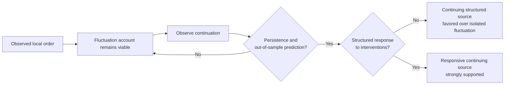
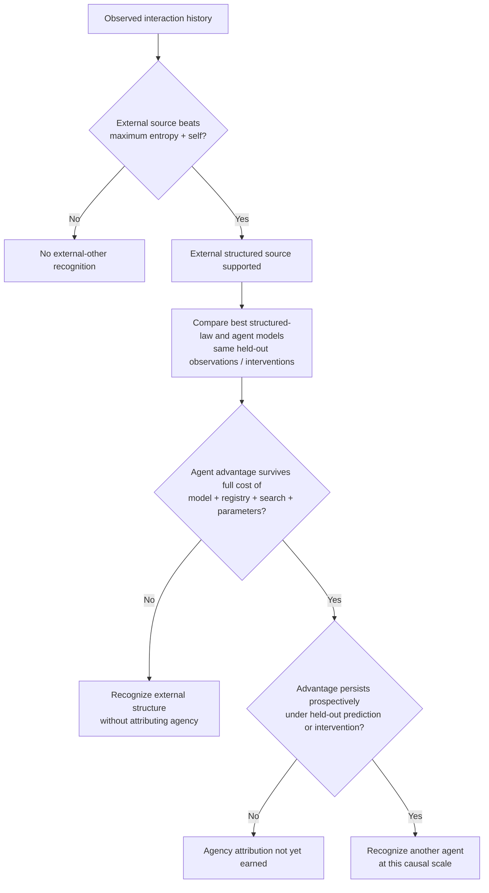
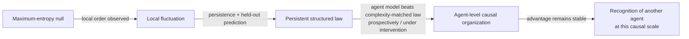

# Negentropy, Fluctuation, and the Recognition of Another Agent

**Franklin Silveira Baldo**  
Independent Researcher  
franklinbaldo@gmail.com

---

> **Companion clarification.** This note refines the account of agent
> recognition in `informational-time/informational-time.md`. It does not define agency by excluding
> evolutionary, collective, distributed, or otherwise unconventional sources of
> organized behavior. It specifies what an observer must distinguish before it
> can rationally attribute persistent local order to another causal source.

## Prior-art boundary and contribution

The component ideas used here have substantial antecedents and are not claimed as independent inventions. Predictive and compressive usefulness as a reason to adopt an intentional or higher-level description is central to Dennett's intentional-stance and real-patterns programme [1]. Bayesian inverse planning formalizes inference over latent goals and beliefs from observed action [2]. Human agency attribution has been linked empirically to perceived departures from randomness [3], while predictive-coding accounts already frame agency detection as Bayesian inference over hidden causes [4]. Sequential evidence accumulation and first-threshold stopping are classical [5], and prequential/MDL traditions already connect sequential predictive performance to model selection and description length [6,7]. Goal-recognition work also predates this note both in measuring how much observation is required before a hidden goal can be distinguished [8] and in using active interventions to accelerate recognition [9]. Contemporary agent-evaluation work independently studies behavioural and representational evidence for goal-directedness [10].

The candidate contribution of this companion note is therefore narrower. It is the operational conjunction of four explicitly competing families — maximum-entropy background, self-generated/channel-induced structure, structured non-agent law, and agent-level model — with the agent family charged for model, registry, search, and fitted-parameter cost, and with any retrospective advantage required to survive prospectively on held-out prediction or intervention. The criterion may optionally be located along the observer-relative informational-cost axis developed in `informational-time/informational-time.md`. A dedicated repository prior-art audit did not locate this exact full conjunction before the note's public cutoff, but that bounded negative search is not a claim of priority or exhaustive novelty.

No empirical benchmark has yet validated the four-family criterion. The hypotheses below remain prospective, and any eventual positive result must be tested for sensitivity to the admissible model families and to capacity matching between `M_law` and `M_agent`.

## 1. The maximum-entropy null is relative to the observer

Suppose an agent $A$ is immersed in an external world about which it initially
possesses no usable distinctions beyond those already represented in its own
state. The relevant baseline is not the literal claim that the entire physical
universe has reached thermodynamic equilibrium. Such a universe would not
support the gradients, memories, or stable internal states required for $A$ to
exist as an observer.

The baseline is instead epistemic and model-relative:

> In the absence of evidence to the contrary, $A$ represents the external
> degrees of freedom available to it by the maximum-entropy distribution
> compatible with its present observations, constraints, and prior internal
> state.

Let this observer-relative null be:

$$
\mathcal M_{\max}^{A}.
$$

It is the least structured distribution admitted by what $A$ already knows. It
does not assert that the world is absolutely structureless. It states that $A$
has not yet earned a more structured external model.

## 2. Maximum entropy does not prohibit organized fluctuations

A maximum-entropy background does not imply that every local configuration is
visibly disordered. Any finite organized configuration with nonzero probability
may occur as a fluctuation.

If a specified organized pattern has probability $p>0$ in each of $N$
approximately independent opportunities, the probability that it occurs at
least once is:

$$
P_N=1-(1-p)^N.
$$

Therefore:

$$
\lim_{N\rightarrow\infty}P_N=1.
$$

Given sufficient spatial extent, temporal duration, or repeated sampling,
configurations of arbitrarily low but nonzero probability are not merely
possible. Their occurrence becomes overwhelmingly likely, and under the ideal
limit above almost sure.

This observation prevents an immediate inference from local order to agency. A
fluctuation may produce:

- an organized object;
- a coherent finite message;
- an apparent memory;
- a machine-like configuration;
- a finite transcript that resembles deliberate behavior;
- even an observer with internally consistent but fluctuation-produced states.

The appearance of local negentropy is therefore evidence of structure, but it
is not by itself sufficient evidence of another persistent agent.

## 3. From local negentropy to a continuing causal source

The relevant contrast is not:

$$
\text{maximum entropy}
\quad\text{versus}\quad
\text{any local order}.
$$

It is:

$$
\text{isolated negentropic fluctuation}
\quad\text{versus}\quad
\text{persistent causal production of organized distinctions}.
$$

A finite fluctuation can imitate any finite pattern. What increasingly favors a
continuing causal source is not the first appearance of order, but the ordered
history that follows it. Evidence accumulates when the structure:

1. persists beyond the duration expected under the fluctuation model;
2. generates further distinctions correlated with its earlier states;
3. responds systematically to interventions by $A$;
4. maintains, repairs, reproduces, or transforms its organization;
5. continues to yield out-of-sample predictive gain as new interaction arrives.

The evidential logic is temporal: one organized observation is compatible with a rare fluctuation, whereas persistence, prediction, and intervention-sensitive response progressively stress that account.

The figure does not equate responsiveness with agency; it only shows how a continuing-source explanation can earn support before the separate agent-versus-structured-law comparison in §4.

This is an evidential distinction, not an absolute logical proof. No finite
transcript is impossible under every sufficiently broad stochastic model. Agent
recognition is therefore a warranted change of model, not a metaphysical
certainty extracted from one observation.

## 4. The other must also be distinguished from the self

Observed order may be caused by $A$ itself, by the interaction protocol, by an
external structured law, or by an agent-like source. Recognition of another
agent therefore requires comparison among at least four model families:

$$
\mathcal M_{\max}^{A}
\quad
\text{maximum-entropy external background compatible with what $A$ knows},
$$

$$
\mathcal M_{\mathrm{self}}^{A}
\quad
\text{order explained by $A$'s own states, actions, and known channel effects},
$$

$$
\mathcal M_{\mathrm{law}}^{A}
\quad
\text{a persistent external structured process described by non-agent dynamics},
$$

$$
\mathcal M_{\mathrm{agent}}^{A}
\quad
\text{a persistent organized source whose latent state and contingent behavior}
\text{ support an agent-level model}.
$$

An external source becomes recognizable when an external model defeats maximum
entropy and self-generation. Agency requires the stronger result that an agent
model predicts and compresses the continuing interaction better than the best
structured non-agent law as well, after the full costs of the model, registry,
search, and fitted parameters are charged. High predictability, concentration,
or deterministic limiting observables can therefore establish structure without
establishing agency.

The recognition test has two distinct evidential gates. First, the observer must earn a model of an external continuing source over fluctuation and self-generation. Only then does it compare agent and non-agent structured models on the same held-out interface, with the agent model charged for its extra descriptive machinery.

The revised figure makes the complexity charge and matched prospective comparison load-bearing: evidence for an external organized source is weaker than evidence for agency, and an agent account does not win merely by being a more flexible model class.

That fairness requirement is substantive rather than cosmetic. The selected result may change when either comparator family is enriched. A benchmark should therefore use predeclared capacity controls — for example nested `M_law`/`M_agent` families, matched effective parameter or description budgets, and sensitivity analyses across reasonable model classes. If an apparent agent advantage disappears when the structured-law family receives comparable expressive capacity, the criterion has not established agency; it has only exposed an asymmetric benchmark.

Intervention is especially informative. If changing $A$'s actions produces
structured responses that cannot be derived from $A$ alone, the evidence for an
external continuing source increases.

## 5. Agency is not reserved for a preferred ontology

The framework should not define a null class by placing evolution, collective
organization, distributed control, or other inconvenient cases outside agency
by stipulation. That would manufacture the desired boundary rather than discover
it.

Instead, the framework uses **agent** relationally:

> For observer $A$, an agent is a causal source whose persistent production,
> conservation, and transformation of organized distinctions is better modeled
> at an agent-relevant causal scale than as a maximum-entropy fluctuation, a
> consequence of $A$ alone, or the best available structured non-agent law.

Nothing in this definition requires the source to be:

- an individual organism;
- spatially centralized;
- consciously deliberative;
- designed rather than evolved;
- bounded at a scale chosen in advance.

An evolutionary process, lineage, colony, ecosystem, institution, market,
civilization, or distributed computational system may qualify whenever it is
the causal scale at which the persistence and production of local negentropy
become predictively intelligible.

This does not mean that every organized process must be called an agent. It
means that the classification must follow the comparative explanatory result
and the adopted relational criterion, rather than an ontological exclusion
inserted into the benchmark beforehand.

## 6. Revised recognition criterion

Let $D_{1:T}$ be the interaction available to $A$ at time $T$. Define the best
non-agent account:

$$
L_{0,T}
=
\min_{M\in
\mathcal M_{\max}^{A}
\cup\mathcal M_{\mathrm{self}}^{A}
\cup\mathcal M_{\mathrm{law}}^{A}}
L(D_{1:T},M).
$$

Define the best agent-level account:

$$
L_{1,T}
=
\min_{M\in\mathcal M_{\mathrm{agent}}^{A}}
\left[
L(R_T,M)+L(D_{1:T}\mid R_T,M)
\right].
$$

The retrospective evidence for another continuing source is:

$$
E_T^{\mathrm{other}}=L_{0,T}-L_{1,T}.
$$

Positive evidence means that the agent-level account compresses the observed
history better after complete accounting. Recognition additionally requires
prospective success: the agent model must continue to predict held-out primitive
observations or intervention responses better than the fluctuation, self, and
structured-law models. The registry is an observer-relative instrument in this
comparison; exact recovery of one token hierarchy is neither necessary nor
sufficient for recognizing agency.

The directional critical recognition time should therefore be understood as:

> the accumulated informational time at which an agent-level model becomes and
> remains a better predictive and descriptive account of the interaction than
> observer-relative maximum entropy, self-generated order, and the strongest
> admissible structured non-agent law.

It is not the time of the first low-entropy configuration. It is the time at
which the continuing causal organization of that configuration makes the
fluctuation explanation noncompetitive under the specified thresholds and model
classes.

## 7. Experimental consequences

The experimental program should include the following matched comparisons:

- isolated low-probability organized samples versus persistent generators;
- fluctuation models with the same finite prefixes as source models;
- self-caused structure versus externally responsive structure;
- structured stochastic or deterministic laws with stable macroscopic observables versus agent-like sources;
- passive observation versus interventions selected by $A$;
- centralized, distributed, collective, and evolutionary source models;
- alternative causal scales for the same observed process;
- finite transcripts on which fluctuation and source models are intentionally
  indistinguishable, followed by continuations that separate them.

A useful benchmark should not ask only whether an agent model defeats random,
stationary, or simplistic deterministic baselines. It should ask when an
agent-level model earns its additional commitments over the strongest
fluctuation, self-generation, and structured external-law explanations available
to the observer. All models should be compared at the same primitive observation
interface even when they use different internal tokenizations.

The benchmark should also include established comparators rather than only bespoke implementations: prefix-to-recognition measures in the spirit of worst-case distinctiveness [8], inverse-planning models [2], sequential-threshold baselines [5], and prequential/MDL model-selection baselines [6,7]. These controls are needed to show whether the four-family construction adds anything beyond known recognition and model-selection machinery.

## 8. Clarified hypotheses

### H1: Local order alone does not establish another agent

A single organized configuration can receive high likelihood under a suitably
conditioned fluctuation model and need not justify a persistent-source model.

### H2: Persistence separates sources from matched fluctuations

For continuations generated by a continuing organized source, cumulative
predictive and description-length evidence will increasingly favor the source
model over fluctuation models matched on the same initial prefix.

### H3: Intervention separates agent-level response from self and law

When the external source responds contingently to probes, intervention data will
favor $\mathcal M_{\mathrm{agent}}^{A}$ over both
$\mathcal M_{\mathrm{self}}^{A}$ and $\mathcal M_{\mathrm{law}}^{A}$ more
quickly than matched passive observation, provided the response cannot be
captured by a complexity-matched non-agent dynamics model.

### H4: Recognition scale is empirical

The causal scale at which the best agent-level account is found may be an
organism, population, lineage, collective, ecosystem, institution, or other
distributed process. Fixing that scale by definition will sometimes worsen
prediction and compression.

### H5: Sufficient scale makes rare finite order unsurprising

For any fixed finite organized pattern with nonzero per-opportunity probability,
the probability of at least one occurrence increases toward one as the number
of approximately independent opportunities grows.

### H6: Structured predictability does not by itself establish agency

High-dimensional stochastic ensembles, deterministic dynamics, or other
non-agent processes may yield persistent, sharply predictable macroscopic
observables. When a structured-law model explains those observables at lower
total cost, an agent model should not be selected merely because the process is
ordered or predictable.

## 9. Consequence for the broader framework

The informational-time proposal begins with an observer that cannot initially
distinguish an external other from an entropy-maximizing background. Scale makes
rare islands of order inevitable under broad conditions, so negentropy by itself
cannot perform the recognition step.

What reveals an external source is the accumulation of a causal history in
which order persists beyond fluctuation and self-generation. What can justify an
agent-level interpretation is the further result that the source's continuing
organization and intervention-sensitive behavior cannot be economically
captured by the best structured non-agent law. Recursive tokenization may record
that history, but it remains an observer-relative representational instrument;
symmetry identifies candidate invariants, and primitive prediction tests whether
the inferred causal scale continues to earn its explanatory role.

The resulting progression is an **evidential** progression, not a causal chain: each arrow denotes the extra evidence needed to justify a more structured explanatory model.

Agency is the relational interpretation earned at the final step, not a synonym
for order, predictability, or compressibility. The framework leaves open which
physical, biological, computational, collective, or evolutionary processes will
earn it and at which causal scale.

The principal limitation of the current note is therefore empirical and benchmark-relative. The exact four-family conjunction has not yet been validated against the established recognition/model-selection baselines above, and conclusions can depend on the model classes, coding language, capacity controls, intervention policy, observer, and causal scale. The contribution claimed here is the testable comparison contract, not evidence that the contract has already identified agency correctly in any natural or artificial system.

## References

[1] Daniel C. Dennett. “Real Patterns.” *The Journal of Philosophy*, 88(1), 1991. DOI: [10.2307/2027085](https://doi.org/10.2307/2027085).

[2] Chris L. Baker, Rebecca Saxe, and Joshua B. Tenenbaum. “Action understanding as inverse planning.” *Cognition*, 113(3), 2009. DOI: [10.1016/j.cognition.2009.07.005](https://doi.org/10.1016/j.cognition.2009.07.005).

[3] Yuan Meng, Thomas L. Griffiths, and Fei Xu. “Inferring Intentional Agents From Violation of Randomness.” 2017. [Princeton publication record](https://collaborate.princeton.edu/en/publications/inferring-intentional-agents-from-violation-of-randomness/).

[4] Marc Andersen. “Predictive coding in agency detection.” *Religion, Brain & Behavior*, first published online 2017. DOI: [10.1080/2153599X.2017.1387170](https://doi.org/10.1080/2153599X.2017.1387170).

[5] Abraham Wald. “Sequential Tests of Statistical Hypotheses.” *Annals of Mathematical Statistics*, 16(2), 1945. DOI: [10.1214/aoms/1177731118](https://doi.org/10.1214/aoms/1177731118).

[6] A. P. Dawid. “Present Position and Potential Developments: Some Personal Views: Statistical Theory — The Prequential Approach.” 1984. DOI: [10.2307/2981683](https://doi.org/10.2307/2981683).

[7] Jörg Bornschein, Yazhe Li, and Marcus Hutter. “Sequential Learning Of Neural Networks for Prequential MDL.” 2022. [arXiv:2210.07931](https://arxiv.org/abs/2210.07931).

[8] Sarah Keren, Avigdor Gal, and Erez Karpas. “Goal Recognition Design.” *Proceedings of ICAPS 2014*. DOI: [10.1609/icaps.v24i1.13617](https://doi.org/10.1609/icaps.v24i1.13617).

[9] Maayan Shvo and Sheila A. McIlraith. “Active Goal Recognition.” *Proceedings of AAAI 2020*. DOI: [10.1609/aaai.v34i06.6551](https://doi.org/10.1609/aaai.v34i06.6551).

[10] Raghu Arghal et al. “A Behavioural and Representational Evaluation of Goal-Directedness in Language Model Agents.” 2026. [arXiv:2602.08964](https://arxiv.org/abs/2602.08964).
