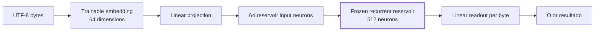
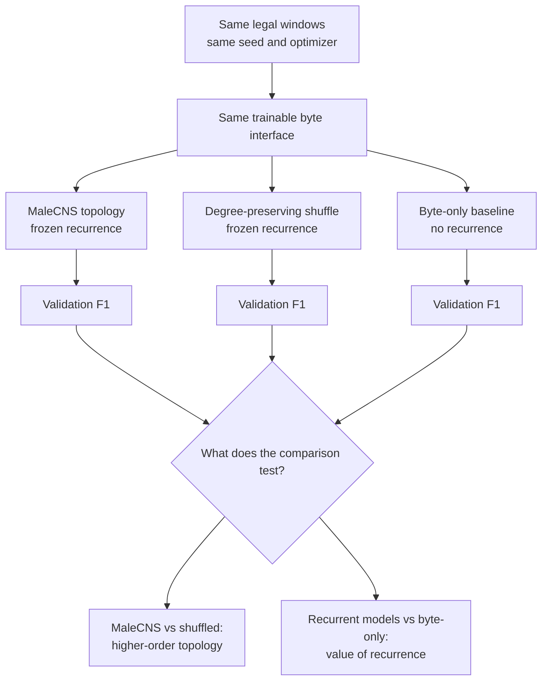
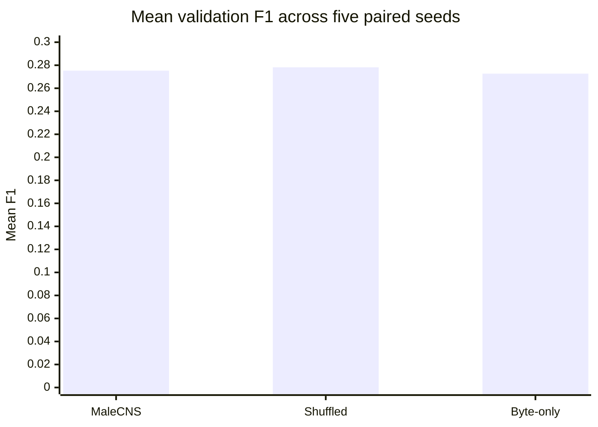

# MaleCNS as a Frozen Reservoir for Byte-Level Legal Sequence Tagging

**Franklin Baldo**  
Independent Researcher  
franklinbaldo@gmail.com

---

> **Status.** Methodological diagnostic, not a decisive negative test of the intended MaleCNS hypothesis. The completed five-seed run is preserved as a reproducible historical baseline for a reduced 512-neuron open-loop reservoir formulation. The intended architecture requires a whole-connectome closed feedback loop with explicit reward/value semantics and matched whole-system controls; until that redesign is tested, this manuscript remains a draft and the old null result must not be generalized to MaleCNS as a whole-brain learning substrate.

## Abstract

Animal connectomes provide a rare source of large, structured recurrent graphs whose topology was not optimized for conventional machine-learning benchmarks. Recent work has shown that a Drosophila connectome can be used as a computational reservoir for time-series prediction. We ask a different question: can a frozen recurrent reservoir constrained by the newly released MaleCNS v1.0 connectome provide useful contextual signal for byte-level sequence tagging of legal text?

We construct a 512-neuron subgraph selected deterministically by weighted synaptic degree from MaleCNS v1.0, preserve all internal directed edges, normalize recurrent weights by postsynaptic incoming contact mass, and freeze the recurrent operator. UTF-8 bytes are mapped through a trainable 64-dimensional embedding and projected into 64 reservoir neurons; a linear readout predicts `resultado` versus `O` at each byte. We compare the biological wiring against (i) a directed degree-preserving shuffled reservoir with the same node count, edge count, per-node in/out degree, edge-weight multiset, trainable architecture, initialization seed, and data windows, and (ii) a byte-only embedding/readout baseline.

Across five paired seeds under the initial three-epoch protocol, MaleCNS achieved mean validation F1 `0.2753 ± 0.0682`, compared with `0.2782 ± 0.0610` for the degree-preserving shuffled reservoir and `0.2727 ± 0.0562` for the byte-only baseline. The paired MaleCNS-minus-shuffled difference was `-0.0029 ± 0.0284` F1, with MaleCNS winning three of five seeds; MaleCNS-minus-byte-only was `+0.0026 ± 0.0140`, with MaleCNS winning two of five. These results establish a reproducible connectome-constrained tagging pipeline for this reduced formulation, but they do not constitute a decisive test of the intended MaleCNS architecture. The experiment uses only a 512-neuron high-degree subgraph and an open-loop supervised readout; it therefore provides no basis for generalizing the null result to a whole-connectome, closed-loop, reward-driven MaleCNS system.

The first seed's training loss continued to fall sharply through epoch three, but longer training alone is no longer treated as the main unresolved question. The stronger methodological revision is architectural: use the full available MaleCNS graph, close the perception–state–action–reward loop, define reward/value and temporal credit assignment explicitly, keep trainable interfaces around a frozen biological core, and compare against matched closed-loop null brains under the same sensor, actuator, curriculum and compute budgets. Longer-training diagnostics remain useful only as evidence about the old reduced formulation.

**Keywords:** connectome, Drosophila, MaleCNS, reservoir computing, sequence tagging, legal NLP, recurrent neural networks

---

## 1. Question

Reservoir computing separates a recurrent dynamical substrate from a comparatively small trainable interface. In the classical formulation, the recurrent graph is usually random and frozen while an input mapping and readout are fitted to a task. This makes reservoir computing a natural setting for asking whether the structure of a biological connectome contains computationally useful inductive bias without requiring end-to-end training of the recurrent network.

The present study asks a deliberately narrow question:

> Given the same input representation, trainable adapter, readout, data windows, and optimization procedure, does a frozen recurrent reservoir constrained by MaleCNS wiring improve byte-level legal sequence tagging relative to simpler or topology-destroying controls?

The experiment is not a claim that the implemented dynamics reproduce Drosophila neurophysiology. MaleCNS supplies recurrent topology and contact-count structure. The rate dynamics, input mapping, leak parameter, recurrent gain, loss, and readout are engineered choices.

## 2. Background and nearest prior work

MaleCNS v1.0 was released by the Janelia FlyEM project on 8 June 2026 and covers the male fruit fly brain and ventral nerve cord. The project page reports the official publication on 3 September 2026 and licenses the dataset under CC BY. The public release exposes flat connectivity files, annotations, synapses, skeletons, and other representations suitable for programmatic analysis.

Connectome-as-reservoir computation itself predates this study. Suárez et al.'s `conn2res` framework treats biological connectivity matrices as reservoir architectures, supports supervised task datasets and trained readouts, and includes connectivity rewiring/manipulation for topology studies. Morra et al. transplanted a Drosophila lateral-horn connectome into a reservoir computer before the MaleCNS release. Costi et al. (2025), the immediate methodological precedent for this experiment, used Drosophila connectome topology and synaptic-weight information to construct reservoirs for multivariate chaotic time-series prediction and compared them with randomized and hybrid controls. These works mean that neither a frozen biological graph with a trained readout nor randomized topology/weight controls are contributions of the present paper.

Reservoir computing had also already reached NLP sequence labeling: Huang, Wang & Safarzadeh (2025) used an echo-state-network component for named-entity recognition. More importantly, before this paper's first public commit, Codex & Alex Wormuth's *Flies Are All You Need* (2026-09-11) had already coupled MaleCNS v1.0 to language-model inputs as a frozen anatomical reservoir with a trained readout and a direct no-graph control. Thus MaleCNS + language input + frozen reservoir + trained readout is not claimed as new here.

The narrower experimental contribution tested in this paper is the conjunction of **byte-level Portuguese legal span tagging**, a **directed degree-preserving shuffled recurrent null** that preserves low-order graph statistics and the recurrent weight multiset, a **non-recurrent byte-only baseline**, and **paired seeds/data/optimization**. The claim-specific prior-art audit did not locate that exact package before the paper's 2026-09-13 cutoff, but that negative search result is not a claim of exhaustive priority.

The purpose of the matched shuffled control here is therefore central rather than cosmetic. If recurrence itself helps, both the MaleCNS and shuffled reservoirs may outperform a non-recurrent byte baseline. Evidence specifically about biological topology requires MaleCNS to beat a null that preserves low-order graph statistics while destroying much of the higher-order wiring organization.

## 3. Data and task

### 3.1 Legal corpus

The experiment reads the CausaGanha segmenter splits from repository commit:

`7c3d6557bb692932553622ae6e00493ba04e534f`

Only `train.jsonl` and `val.jsonl` participate in the current exploratory pipeline. `test.jsonl` is intentionally untouched and reserved for a later confirmatory evaluation.

The completed five-seed run contains:

- 14 training documents;
- 3 validation documents;
- 42 training windows;
- 9 validation windows.

The target is binary byte-level tagging of the `resultado` span versus `O`.

### 3.2 Byte representation

Text is encoded directly as UTF-8 bytes. Character-based source annotations are converted to byte offsets before training, preserving alignment for multibyte characters. Each window contains 192 bytes. The model uses a trainable embedding of dimension 64, avoiding a pretrained language model and deliberately keeping the textual interface small.

The initial pipeline is:



The diagram separates the trainable text interface from the frozen recurrent substrate: gradients update the embedding, projection, and readout, while the MaleCNS-derived recurrent operator remains fixed.

## 4. MaleCNS reservoir

### 4.1 Source provenance

The implementation downloads the public MaleCNS v1.0 annotation and connectivity files directly from the Janelia-hosted flat-connectome release and verifies file sizes and SHA-256 digests before use.

For the completed baseline run:

- annotations SHA-256: `2177e246113e4cfbf1e7772ec37c6da1955ff22e8063d0b1f833101f99a9a3b2`;
- connectivity SHA-256: `e35da783d1c686b2b58b3b87cd6a403ae43bfcfba8bff28e08ef752c1a56afc1`.

### 4.2 Subgraph selection

The initial capacity baseline uses 512 MaleCNS neurons. Candidate neurons are ranked by weighted synaptic degree, and the highest-degree retained neurons are selected deterministically. All directed connections between selected neurons are preserved.

The resulting baseline graph contains:

- 512 neurons;
- 16,726 internal directed edges.

Raw contact counts are normalized by the total incoming contact mass at the postsynaptic neuron. The recurrent matrix is frozen during training.

### 4.3 Engineered dynamics

At each byte step, the reservoir state is updated with a leaky `tanh` recurrence. The v1 defaults are:

- leak: `0.35`;
- recurrent gain: `0.9`;
- input gain: `0.5`.

These are computational hyperparameters, not inferred membrane or synaptic physiology.

## 5. Controls

### 5.1 Degree-preserving recurrent null

For every paired seed, a null reservoir is generated from the same MaleCNS subgraph using directed double-edge swaps. The procedure performs ten successful swaps per edge while avoiding self-edges and duplicate directed edges.

The control preserves:

- node count;
- directed edge count;
- every neuron's in-degree;
- every neuron's out-degree;
- the multiset of recurrent edge weights;
- the learnable architecture;
- initialization seed;
- input windows;
- optimizer and evaluation procedure.

It destroys much of the higher-order organization of the MaleCNS wiring. This makes MaleCNS-versus-shuffled the primary topology comparison.

The experimental logic is easier to read as a paired-control graph:



This figure makes the causal contrast explicit: the MaleCNS-versus-shuffled comparison isolates topology more narrowly than a MaleCNS-versus-byte-only comparison, which also changes the presence of recurrence itself.

### 5.2 Byte-only baseline

The byte-only baseline removes recurrence entirely:

```text
UTF-8 byte → trainable 64d embedding → linear readout
```

It measures whether adding a recurrent state provides useful context beyond the local byte embedding.

### 5.3 Trivial baseline

An all-`O` predictor is retained as a task sanity reference. Because positive spans are sparse, accuracy alone is not informative; F1, precision, recall, and confusion counts are tracked.

## 6. Experimental protocol v1

Five seeds are evaluated:

`20260912, 20260913, 20260914, 20260915, 20260916`.

Within each seed, MaleCNS and the shuffled recurrent null use the same window sampling, trainable architecture, initialization seed, optimizer, and validation evaluation. Across seeds, window sampling and initialization vary together so that paired F1 differences capture end-to-end pipeline variability.

The v1 training configuration is:

- 512 recurrent neurons;
- 64 recurrent input neurons;
- 64-dimensional byte embedding;
- 3 epochs;
- batch size 4.

The run was executed through the repository's Kaggle GPU workflow. Canonical GitHub Actions run: `34767179457`. Artifact: `malecns-tagger-34767179457`; artifact digest: `sha256:fa4d7c058f2ac495897794885344ec9e34b43b9577f8931855718788ad39b656`.

## 7. Results: five-seed baseline

### 7.1 Aggregate validation F1

| Model | Mean F1 | Std. dev. | Interpretation |
|---|---:|---:|---|
| MaleCNS reservoir | **0.2753** | 0.0682 | biological wiring condition |
| Degree-preserving shuffled | **0.2782** | 0.0610 | matched recurrent null |
| Byte-only | **0.2727** | 0.0562 | no recurrent context |

The three conditions are close relative to seed-to-seed variability.



The zero-based axis keeps the visual comparison proportional: the bars are nearly the same height, matching the paper's conclusion that the observed mean differences are small relative to seed-to-seed dispersion.

### 7.2 Paired differences

MaleCNS minus shuffled, by seed:

`[-0.00373, +0.01574, +0.01890, +0.00566, -0.05117]`

Mean paired difference:

`-0.00292 ± 0.02840` F1.

MaleCNS won three of five paired seeds, while shuffled won two. The negative mean and dispersion substantially larger than the mean difference provide no evidence of a stable topology advantage.

MaleCNS minus byte-only, by seed:

`[+0.01033, -0.01124, +0.02309, -0.00269, -0.00654]`

Mean paired difference:

`+0.00259 ± 0.01399` F1.

MaleCNS won two seeds and byte-only won three. Thus the current data also do not support a stable recurrence advantage under the three-epoch protocol.

### 7.3 The first seed and the undertraining question

The first paired seed produced MaleCNS F1 `0.33236`, shuffled F1 `0.33609`, and byte-only F1 `0.32203`. More importantly for experimental design, MaleCNS training loss fell:

`0.61896 → 0.36773 → 0.28081`.

The loss was still decreasing markedly at the fixed endpoint. The v1 implementation also reported the final epoch rather than restoring the epoch with best validation F1. Consequently, the experiment cannot yet distinguish a genuine capacity/representation limit from premature stopping or poor model selection.

## 8. What the baseline establishes

The baseline establishes four useful facts.

First, a MaleCNS-constrained sparse recurrent graph can be integrated into a GPU training pipeline for byte-level legal sequence tagging.

Second, the trainable input adapter and readout can learn through a frozen connectome-derived recurrent state.

Third, a degree-preserving recurrent null can be generated and trained under paired conditions, making future topology claims falsifiable.

Fourth, the initial three-epoch experiment does **not** show that biological MaleCNS wiring improves tagging. The correct scientific result at this stage is indeterminate/negative with respect to topology advantage.

## 9. Registered training-regime diagnostic v2

Before increasing reservoir capacity, the next experiment changes only training duration and checkpoint selection at the same 512-node scale.

Frozen elements:

- same legal data and split;
- same 192-byte window procedure;
- same five paired seeds;
- same MaleCNS 512-node selection;
- same 64d byte embedding;
- same 64 input neurons;
- same recurrent dynamics;
- same shuffled and byte-only controls.

Changed elements:

- maximum epochs: `3 → 30`;
- minimum epochs before stopping: `5`;
- best-validation-F1 checkpoint restoration;
- early stopping after five epochs without F1 improvement;
- learning-rate reduction on validation-F1 plateaus;
- explicit `best_epoch` and `stopped_epoch` logging.

This experiment answers a diagnostic question: was the v1 comparison materially training-limited?

Because validation F1 determines checkpoint selection, v2 remains exploratory/model-selection evidence. It cannot serve as the final held-out performance estimate.

## 10. Planned confirmatory design

A confirmatory run should freeze the selected training regime before touching `test.jsonl`.

At minimum it should compare:

1. true MaleCNS reservoir;
2. degree-preserving shuffled MaleCNS reservoir;
3. byte-only baseline;
4. a small conventional sequential baseline such as a parameter-matched GRU or 1D temporal CNN.

The final claim should distinguish three possibilities:

- **topology advantage:** MaleCNS consistently beats both shuffled recurrence and non-biological sequential baselines;
- **recurrence advantage only:** MaleCNS and shuffled both beat non-recurrent baselines but remain statistically indistinguishable from one another;
- **no useful reservoir signal:** recurrence does not improve held-out tagging enough to justify the added compute.

Only the first outcome supports a claim about the specific MaleCNS topology.

## 11. Capacity scaling

Separate branches already prepare 5,000- and 10,000-neuron reservoirs. Capacity scaling is scientifically useful, but it should be interpreted after the training-regime gate. Otherwise an improvement from 512 to 5,000 neurons would be confounded with a baseline that may simply have been stopped too early.

A reasonable progression is:

`512 → 1k/2k diagnostic if needed → 5k → 10k if resource-feasible`.

Input fan-in should also eventually be tested (`64 → 128 → 256` input neurons), because holding the input interface fixed while expanding the reservoir by an order of magnitude may create an artificial bottleneck.

## 12. Limitations

### 12.1 Very small legal dataset

Fourteen training documents and three validation documents are insufficient for a strong generalization claim. The present study is an engineering probe, not a benchmark result.

### 12.2 Sparse window extraction

The v1 sampling strategy produces only 42 train and 9 validation windows. More comprehensive sliding-window coverage may be more consequential than reservoir scaling.

### 12.3 Validation reuse

The current validation split has been inspected repeatedly. It is appropriate for model development but not for a terminal claim. The untouched test split is therefore essential.

### 12.4 Engineered neural dynamics

MaleCNS contributes connectivity constraints, not a complete physiological simulation. Neurotransmitter effects, cell-specific dynamics, neuromodulation, delays, and many other biological properties are absent.

### 12.5 Subgraph selection bias

Selecting the highest weighted-degree neurons is computationally convenient but is not guaranteed to preserve task-relevant biological organization. Other selections—sensory-to-central pathways, cell-class-balanced subsets, random induced subgraphs, or full-connectome execution—may behave differently.

## 13. Reproducibility

The experiment code and workflows live in `franklinbaldo/franklinbaldo.github.io` under `scripts/malecns-tagger/` and `.github/workflows/`.

Key provenance:

- CausaGanha data commit: `7c3d6557bb692932553622ae6e00493ba04e534f`;
- experiment implementation/workflow commit: `b68aa9f03f5972f0e0ebf3eb3a4770e12af2e7a0`;
- v1 five-seed workflow run: `34767179457`;
- v1 artifact digest: `sha256:fa4d7c058f2ac495897794885344ec9e34b43b9577f8931855718788ad39b656`;
- MaleCNS annotations SHA-256: `2177e246113e4cfbf1e7772ec37c6da1955ff22e8063d0b1f833101f99a9a3b2`;
- MaleCNS connectivity SHA-256: `e35da783d1c686b2b58b3b87cd6a403ae43bfcfba8bff28e08ef752c1a56afc1`.

The separate `franklinbaldo/papers` MaleCNS runtime experiment compiles the full public MaleCNS graph through an independent pipeline. It is intentionally not substituted into this tagger study while the original pipeline is being characterized, providing an opportunity for later cross-implementation reproducibility checks.

## 14. Conclusion

The first five-seed MaleCNS legal-tagging experiment yields a useful negative/indeterminate result. A frozen MaleCNS-constrained reservoir can participate in byte-level tagging, but under the initial three-epoch protocol its average F1 is essentially indistinguishable from a degree-preserving shuffled recurrent graph and from a much simpler byte-only baseline.

That result is valuable because the matched null prevents a small recurrence gain from being mistaken for evidence about biological wiring. The next question is not whether the experiment can be made larger, but whether its current training regime prematurely truncates the learnable adapter and readout. The registered v2 diagnostic tests exactly that while keeping the graph, data, and paired controls fixed.

If v2 shows that best checkpoints occur well after epoch three, the original baseline was undertrained and the experiment earns a better-trained confirmatory design. If not, attention should shift to window coverage, input mapping, reservoir dynamics, and stronger task baselines before additional biological-topology claims are entertained.

---

## References

1. Male CNS Connectome Project. HHMI Janelia FlyEM. MaleCNS v1.0 release and project resources. https://male-cns.janelia.org/
2. Male CNS Connectome Downloads. HHMI Janelia FlyEM. https://male-cns.janelia.org/download/
3. Costi, L.; Hadjiivanov, A.; Dold, D.; Hale, Z. F.; Izzo, D. "The Drosophila Connectome as a Computational Reservoir for Time-Series Prediction." *Biomimetics* 10(5), 341 (2025). https://doi.org/10.3390/biomimetics10050341
4. Suárez, L. E. et al. "Connectome-based reservoir computing with the conn2res toolbox." *Nature Communications* 15 (2024). https://www.nature.com/articles/s41467-024-44900-4
5. Morra, J.; Flynn, M.; Amann, A.; Daley, D. "Multifunctionality in a Connectome-Based Reservoir Computer." arXiv:2306.01885 (2023). https://arxiv.org/abs/2306.01885
6. Huang, H.; Wang, H.; Safarzadeh, H. "Incorporating echo state network and sand cat swarm optimization algorithm based on quantum for named entity recognition." *Scientific Reports* (2025). https://www.nature.com/articles/s41598-025-02275-6
7. Codex; Wormuth, A. "Flies Are All You Need." Preprint, 2026-09-11. https://artificialscientific.com/papers/flies-are-all-you-need ; code: https://github.com/nftechie/flm
