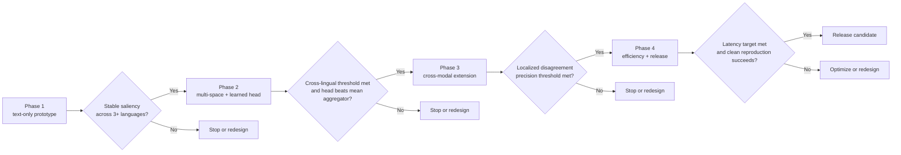

# Pontifex: Byte-Level Occlusion with Multi-Space Convergence for Tokenizer-Free, Cross-Modal Interpretability

**Franklin Baldo**
Independent Researcher
franklinbaldo@gmail.com

---

> **Position paper with a living empirical appendix.** Sections 1–8 preserve
> the original architecture, evaluation protocol, and implementation roadmap.
> Section 9 records completed RED-1 experiments added later. Empirical claims
> in §9 are limited to completed held-out runs and do not retroactively validate
> the broader hypotheses or design targets in the original paper.

## Abstract

Post-hoc interpretability of foundation models is dominated by saliency
methods that operate at the token or region level and probe a single
embedding space, typically tied to a specific tokenizer or modality.
This couples explanations to design choices that vary across models and
languages, and offers no native way to ask whether two models — say, a
text encoder and a vision encoder — agree about *why* an input means
what it means. We propose **Pontifex**, a post-hoc interpretability
framework with three components: (1) **byte-level occlusion**, where
contiguous UTF-8 byte spans (rather than tokens or patches) are masked
or split, eliminating tokenizer dependence and supporting any script;
(2) **bilateral semantic comparison**, where each occlusion produces
three similarity signals (left fragment vs. right fragment, each
fragment vs. the original) instead of a single probability drop; and
(3) a **neural convergence head**, a lightweight attention layer that
learns patterns of agreement across multiple *unaligned* embedding
spaces without learning an explicit mapping between them. We argue
that, *if* the proposed pipeline behaves as designed, Pontifex should
deliver tokenizer-free saliency that is consistent across languages,
runs in roughly half a second per sample, and exposes disagreements
between modalities that single-space methods cannot detect. We
formulate these as falsifiable predictions, distinguish the approach
from embedding-alignment and contrastive-pretraining work, and
describe an experimental protocol and four-phase implementation plan
under which the claims can be tested.

**Keywords:** interpretability, byte-level models, occlusion saliency,
multi-space embeddings, cross-modal alignment, post-hoc explanation

---

## 1. Introduction

Interpretability methods for large neural models can be loosely grouped
into gradient-based attribution (e.g., Integrated Gradients,
SmoothGrad), attention rollouts, surrogate models (LIME, SHAP), and
occlusion- or perturbation-based saliency. Occlusion is attractive
because it makes minimal assumptions about the target model: it treats
the model as a black box and measures how its output changes when part
of the input is removed or masked. In practice, however, three
limitations recur:

1. **Tokenizer or region coupling.** Text-side occlusion masks whole
   subword tokens; vision-side occlusion masks pixel patches. The
   resulting "unit of explanation" is dictated by an implementation
   choice (BPE vocabulary, patch size) rather than by the input or
   the question being asked. For languages where word boundaries do
   not align with subword units, this introduces systematic
   artefacts.

2. **Single-space probing.** A saliency map is produced inside one
   embedding space — usually the same one the model was trained in.
   This makes it impossible to ask whether a *different* model, with
   a different inductive bias or modality, would treat the same span
   as important for the same reason.

3. **Alignment overhead.** When practitioners do want to compare
   models or modalities, the standard recipe is to learn an explicit
   mapping between embedding spaces (Procrustes alignment,
   contrastive pretraining à la CLIP, joint multi-modal training).
   This is expensive, requires paired data, and degrades when the
   spaces are severely non-isomorphic.

We propose **Pontifex**, a post-hoc framework that treats raw UTF-8
bytes as the unit of perturbation, scores each perturbation
*bilaterally* against multiple independent encoders, and learns a
small convergence layer that operates on the resulting similarity
patterns rather than on the embeddings themselves. The intuition is
simple: if a byte span carries meaning that several unrelated encoders
register, the *pattern* of similarity drops should be more informative
than any single encoder's drop, and the convergence layer can be
trained with very little supervision because it sees only scalar
similarity scores, not high-dimensional vectors.

### 1.1 Contributions

The architecture in §§1–8 is the original **position-paper** proposal:
its contributions are conceptual, architectural, and methodological.
The living appendix in §9 separately records subsequent RED-1 evidence
and keeps completed measurements distinct from hypotheses. Specifically:

1. **Byte-level occlusion (proposal):** a tokenizer-free perturbation
   scheme that masks contiguous UTF-8 byte spans, with rules for
   handling multi-byte code points and for sliding window sweeps over
   long inputs.

2. **Bilateral comparison (proposal):** a scoring protocol that
   extracts three similarity signals per perturbation, increasing
   information density and removing the need for a softmax output on
   the target model.

3. **Multi-space convergence head (proposal):** a lightweight
   attention layer trained on stacks of per-encoder similarity scores
   that learns when agreement across encoders is itself a signal,
   without learning a mapping between the spaces.

4. **Falsifiable evaluation protocol (proposal):** explicit
   predictions for speed, cross-lingual consistency, and cross-modal
   disagreement detection, with pass/fail thresholds.

5. **Four-phase implementation roadmap (proposal):** a path from
   a minimal text-only prototype to a multimodal release, with
   exit criteria for each phase.

The remainder of the original paper is organised as follows. Section 2
reviews related work and positions Pontifex against the closest prior
art. Section 3 specifies the method. Section 4 describes the
implementation roadmap. Section 5 sets out the evaluation protocol
and falsifiable predictions. Section 6 discusses limitations and risks.
Sections 7–8 discuss future directions and conclude. Section 9 is a
separately labelled living empirical appendix.

---

## 2. Background and Related Work

### 2.1 Occlusion and perturbation saliency

Occlusion-based attribution was introduced for vision models by Zeiler
and Fergus (2014), who showed that masking patches of an image and
measuring the resulting drop in class probability produced
interpretable saliency maps. The same idea has been adapted to NLP as
"feature erasure" or "token masking," where individual subword tokens
are replaced with a mask token and the model's output is re-scored.
Pontifex inherits the black-box stance of occlusion but moves the
unit of perturbation below the tokenizer.

### 2.2 Byte-level and tokenizer-free models

ByT5 and related byte-level Transformers demonstrated that operating
on raw bytes is feasible at scale, with the main motivation being
robustness to noisy text and uniform handling of all languages and
scripts. Pontifex borrows the byte-level granularity but uses it for
*interpretability* rather than for representation learning: the model
under inspection need not itself be byte-level.

### 2.3 Cross-space and cross-modal alignment

Procrustes alignment, contrastive multimodal pretraining (CLIP,
ALIGN), and domain-adaptation methods all attempt to bring two or
more embedding spaces into a common frame so that distances become
comparable. Pontifex deliberately does *not* align spaces. Instead, it
treats each encoder as a self-contained oracle that emits scalar
similarity scores, and asks a small head to learn agreement patterns
over those scalars. This sidesteps the cost and brittleness of
alignment and accommodates spaces that are structurally
non-isomorphic (e.g., a text encoder, a code encoder, and a vision
encoder).

### 2.4 Position relative to closest prior art

To our knowledge, no published architecture combines (a) byte-level
occlusion, (b) parallel probing of more than two unaligned embedding
spaces, and (c) a learned post-hoc convergence head over similarity
patterns. This claim rests on the authors' own literature search, not
on independent verification: `o3-originality-assessment.md` in this
repository records an AI-assisted preliminary prior-art scan that
motivated this paper, but it is not an independent assessment (see the
editorial note at the top of that file) and its gap analysis should be
read as a starting point, not confirmation.

---

## 3. Method

Pontifex is a function from an input `x` (a UTF-8 byte string, or a
multimodal record containing one) to a saliency map plus a
multi-encoder agreement profile. It has four stages.

### 3.1 Byte-level occlusion

Given an input of length `N` bytes, Pontifex generates a set of
perturbations `{P_i}` by either:

- **Masking:** replacing a contiguous span `[a, b]` with a fixed
  filler sequence (e.g., a configurable byte like `0x20` repeated,
  or a single placeholder code point);
- **Splitting:** cutting the input at position `c` and treating the
  two fragments `x[:c]` and `x[c:]` as separate inputs.

Spans are produced by a sliding window of configurable width and
stride. The default policy respects UTF-8 boundaries: a perturbation
that would split a multi-byte code point is shifted to the nearest
legal boundary. Word, sentence, or other linguistic structure is
*not* used — that is the point.

### 3.2 Bilateral semantic comparison

For each perturbation, Pontifex computes three cosine similarities
per encoder `E_k`:

- `s_LR^k = cos(E_k(x_L), E_k(x_R))` — left fragment vs. right
  fragment,
- `s_LO^k = cos(E_k(x_L), E_k(x))` — left fragment vs. original,
- `s_RO^k = cos(E_k(x_R), E_k(x))` — right fragment vs. original.

For mask-style perturbations, `x_L` is set to the unmasked input and
`x_R` to the masked input, yielding the same three signals. The
intuition is that the *combination* of these three numbers carries
more information than any single delta: a span can be critical
because removing it makes the two halves diverge from each other,
because removing it makes one half drift from the original, or both.
Crucially, the protocol requires no softmax output on the target
model — only an embedding.

### 3.3 Multi-space parallel probing

Pontifex maintains a fixed set of `K` encoders `{E_1, ..., E_K}`,
selected to span complementary inductive biases (e.g., a multilingual
text encoder, a code-aware encoder, a sentence-embedding model, and
optionally a vision-language encoder). Encoders are run in parallel
and never share parameters. For each perturbation `P_i`, Pontifex
emits a tensor `S_i ∈ R^{K x 3}` of similarity scores.

### 3.4 Neural convergence head

A small attention layer `C` consumes the stack `{S_i}` over all
perturbations and produces, for each byte position, a saliency score
and an "agreement profile" — a measure of how concordant the encoders
were about the importance of that span. `C` is trained on a small
labelled dataset of human-annotated salient spans, or via
self-supervised proxies (see Section 5). Because `C` operates on
scalar similarity scores rather than on embeddings, it is cheap to
train and to run, and it does not need to learn any cross-space
mapping.

### 3.5 Computational profile (design target)

The design target is end-to-end latency of roughly 0.5 seconds per
sample on a single consumer GPU for inputs of up to a few kilobytes,
with `K = 3` text encoders and a stride chosen to produce
approximately `N / 16` perturbations. This is a target, not a
measurement; Section 5 specifies the falsification threshold.

---

## 4. Implementation Roadmap

We propose a four-phase plan, each phase with an explicit exit
criterion. Phases are sequential by design: each unlocks the next
only if its predictions hold. The roadmap is therefore a sequence of
scientific gates rather than a simple implementation checklist.

The figure makes the falsifiability of the roadmap explicit: advancement requires the exit criterion of the current phase, so failure blocks later claims instead of being hidden by continued feature expansion.

### 4.1 Phase 1 — Minimal text-only prototype

- Single text encoder (a public multilingual sentence embedding
  model).
- Mask-style occlusion only; sliding window with fixed width and
  stride.
- Bilateral comparison implemented as described in §3.2, but
  consumed by a trivial aggregator (mean of the three signals)
  instead of a learned head.
- Exit criterion: produces stable, qualitatively interpretable
  saliency maps on a fixed test set across at least three languages,
  with no language-specific code paths.

### 4.2 Phase 2 — Multi-space with a learned convergence head

- Add at least two more encoders with distinct inductive biases
  (e.g., a code-aware encoder; a different multilingual model).
- Replace the trivial aggregator with the attention head `C` of §3.4.
- Train `C` on a small dataset of span-level salience annotations,
  plus a self-supervised objective (mask-recovery agreement across
  encoders) for unlabelled data.
- Exit criterion: cross-lingual consistency (Section 5.2) above the
  pre-registered threshold; head outperforms the trivial aggregator
  on the labelled split.

### 4.3 Phase 3 — Cross-modal extension

- Add a vision-language encoder, and lift the input type from "byte
  string" to "multimodal record" (text plus image, with image bytes
  perturbed by patch-level masking and text bytes perturbed as in
  §3.1).
- Re-train `C` to consume mixed text/vision similarity stacks.
- Exit criterion: on a curated set of mismatched text-image pairs
  (e.g., the canonical "red dress" type construction), Pontifex
  flags the disagreement at the correct span with precision above
  the pre-registered threshold.

### 4.4 Phase 4 — Efficiency and release

- Batched perturbation, encoder caching for shared prefixes,
  optional distillation of the encoder bank into smaller students.
- Reference implementation, documentation, evaluation harness, and
  reproducibility package.
- Exit criterion: end-to-end latency target (§3.5) met on commodity
  hardware; reproduction package runs in a clean environment with a
  single command.

Phases 1 and 2 are the minimum viable position; Phase 3 is the
distinctive claim; Phase 4 turns the system into an artifact others
can use.

---

## 5. Evaluation Protocol and Falsifiable Predictions

We pre-register the following predictions. Each has an explicit
threshold at which the corresponding design claim is considered
falsified.

### 5.1 Speed (Phase 1+)

**Prediction.** On inputs of up to 4 kB with `K ≤ 3` text encoders
and the default stride, end-to-end latency on a single consumer-grade
GPU is below 1.0 s per sample (target: 0.5 s).

**Falsification.** Median latency above 2.0 s per sample on the
reference hardware.

### 5.2 Cross-lingual consistency (Phase 1+)

**Prediction.** For parallel translations of the same content across
at least five typologically distinct languages, the saliency maps
produced by Pontifex are consistent under a sentence-aligned
agreement metric (e.g., correlation of per-sentence salience mass)
above 0.7.

**Falsification.** Agreement below 0.4, or a systematic gap of more
than 0.2 between a high-resource language (English) and any other
language in the set.

### 5.3 Convergence head usefulness (Phase 2)

**Prediction.** On a held-out labelled set of span-level salience
annotations, the learned head `C` outperforms (a) the best single
encoder and (b) a trivial mean aggregator by a non-trivial margin
on a standard ranking metric (e.g., span-level NDCG or F1 at the
top-K spans).

**Falsification.** The learned head does not exceed both baselines
on the held-out split, or its margin is within measurement noise.

### 5.4 Cross-modal disagreement detection (Phase 3)

**Prediction.** On a curated benchmark of paired (text, image)
inputs where the text and image disagree on a localised attribute
(colour, count, object identity), Pontifex's agreement profile drops
below a pre-registered threshold at the disagreeing span with
precision above 0.7 at recall 0.5.

**Falsification.** Precision below 0.4 at the same recall, or the
disagreement is localised to the wrong span more often than not.

### 5.5 Ablations

For each component (bilateral comparison, multi-space stack,
learned head), we run an ablation that disables it and verify that
the corresponding metric in §5.1–§5.4 degrades. A component whose
removal does not degrade any metric is considered unjustified and
removed from the architecture.

---

## 6. Limitations and Risks

### 6.1 Methodological

- **Encoder selection bias.** The agreement profile is only as
  meaningful as the diversity of the encoder bank. A bank of three
  encoders trained on overlapping data may agree trivially. Encoder
  selection therefore needs its own justification and ideally its
  own ablation.
- **Byte spans are not semantic units.** Byte-level occlusion is
  tokenizer-free but it is *not* meaning-aligned. Salience reported
  at byte resolution may need to be aggregated to a human-readable
  unit (word, sentence) for downstream consumption.
- **Saliency ≠ explanation.** Like all occlusion methods, Pontifex
  reports *where* the model is sensitive, not *why*. Claims about
  causal explanation should be made with care.

### 6.2 Overlap risks with prior art

- **Contrastive multimodal models (CLIP and successors).** These
  align spaces *during training*, not for *post-hoc* explanation;
  this distinction needs to be made explicit in the write-up to
  avoid reviewer confusion.
- **Multi-space alignment in domain adaptation.** Such work aligns
  *features*, not *interpretations*; the naming overlap is a
  presentation risk, not a substantive one.

### 6.3 Practical

- Memory and latency scale with the number of encoders and with the
  number of perturbations. Phase 4 is therefore not optional for any
  serious deployment.
- For very short inputs (a few bytes), the bilateral protocol
  degenerates and a fallback (e.g., token-level masking against a
  single encoder) is appropriate.

---

## 7. Discussion and Future Directions

Pontifex is deliberately a small idea executed at the right level of
abstraction. The bet is that *most* of the value of cross-encoder
comparison can be extracted from scalar similarity scores, and that
explicitly learning that pattern is cheaper and more portable than
learning a shared embedding space. If the bet holds, three follow-ons
become natural:

1. **Audit trails for legal and regulated domains.** The agreement
   profile is a compact, model-agnostic artefact that can be logged
   alongside a model decision and re-checked offline, which fits the
   audit-by-design programme pursued elsewhere in this repository
   (see the CPC 2015 series and `affordance_restriction.md`).

2. **Disagreement as a training signal.** Spans on which the encoder
   bank disagrees most strongly are candidates for active learning
   or for targeted data collection.

3. **Beyond two modalities.** The convergence head has no structural
   limit on `K`; adding audio or structured-data encoders is a
   matter of engineering, not of method.

The RED-1 programme has since begun. Section 9 records the current
held-out evidence boundary; unsupported outcomes are retained as
falsification pressure rather than overwritten by later variants.

---

## 8. Conclusion

We have argued that post-hoc interpretability can be pushed below the
tokenizer and across embedding spaces without paying the cost of
alignment, and we have sketched the architecture, evaluation, and
implementation plan under which that claim can be tested or refuted.
`o3-originality-assessment.md` records a preliminary, AI-assisted
prior-art scan, not an independent assessment (see the note at the
top of that file); independent verification of the novelty claim is
still pending. This paper turns the proposal into a falsifiable
programme regardless of how that verification resolves.

---

## 9. RED-1 empirical status: SciFact mechanism boundary

This appendix is **post-proposal** and must not be read as a
pre-registration of the original paper. It records only completed runs
and explicitly labels follow-ups motivated by earlier outcomes.

### 9.1 Frozen information boundary

The current SciFact transport diagnostics separate information into
four roles:

- `D_assembly`: SciFact text/split membership plus frozen encoder
  identities; no relevance grades;
- `D_student`: a deterministic 80% of exact-test-overlap-filtered
  train queries, used as unlabeled paired representation coordinates;
- `D_val`: the remaining 20%, used only for coordinate-space
  selection of transport hyperparameters (`tau`, `lambda`);
- `D_test`: official SciFact test relevance grades, opened only after
  the transport map and the complete null-permutation banks are
  frozen.

For the K=512 mechanism diagnostic, B/MPNet coordinates for test queries
and corpus documents are not encoded, and the task-label budget for
fit/selection is zero. This is a transport/mechanism diagnostic rather
than a separate sparse-student experiment, so it is **not** evidence of
`D_assembly -> D_student` generalization.

### 9.2 Completed K=512 global-permutation test

The completed run `35451426518` tests whether the correct K=512
residual-to-anchor assignment is needed for held-out SciFact retrieval
and whether query/document maps benefit from sharing the same
deformation.

Observed nDCG@10:

| Condition | nDCG@10 |
| --- | ---: |
| TRUE residual assignment | 0.649954 |
| COUPLED global-null mean | 0.641013 |
| INDEPENDENT global-null mean | 0.620021 |

Two predeclared contrasts separate the claims:

1. **Exact residual identity:** `TRUE - COUPLED = +0.008940`, but the
   finite-bank upper-tail test gives `p = 0.078125` and the paired-query
   bootstrap 95% interval is `[-0.003652, +0.021549]`. The
   semantic-specificity criterion therefore **fails**. The completed
   data do not establish that exact residual-to-anchor identity is
   necessary at K=512.
2. **Shared-warp coherence:** `COUPLED - INDEPENDENT = +0.020992`, with
   paired-query bootstrap 95% interval `[+0.009079, +0.033756]`. This
   criterion **passes**. The completed data support the narrower claim
   that applying a coherent two-sided deformation preserves more
   held-out retrieval structure than independently scrambling query and
   document deformations.

The positive second result does not rescue the negative first result:
coherence of a shared warp is weaker than evidence for semantically
specific local correspondence.

### 9.3 Prospective nuisance-matched follow-up

The global permutation also changes which residual magnitudes are
assigned to each anchor neighborhood. After observing §9.2, a stronger
**prospective follow-up** was frozen in
`PROTOCOL-SCIFACT-NORM-MATCHED-COUPLING-K512-2026-09-19.md` and
`scifact_norm_matched_coupling_k512.py`.

It keeps K=512 and the same student/validation/test manifests, divides
the true `D_student` residual bank into eight equal-count L2-norm strata,
and uses within-stratum derangements so that no anchor keeps its true
residual. Sixty-three coupled and sixty-three independent null draws are
frozen before `D_test` relevance grades are opened. The predeclared
semantic-specificity rule remains strict: paired-query bootstrap 95%
interval above zero **and** finite-bank `p <= 0.05`.

Because this experiment was designed after seeing §9.2, it is not an
independent confirmation. Its purpose is to ask a narrower question:
does exact residual identity add held-out utility beyond a coherent
warp that already preserves coarse residual-magnitude structure?
Until its run completes, this is a protocol and hypothesis, **not
empirical evidence**.

### 9.4 Evidence / hypothesis boundary

**Supported by the completed SciFact K=512 run:** a shared coherent
query/document deformation outperforms independently scrambled
query/document deformations under the stated frozen split contract.

**Not supported by that run:** the stronger claim that exact local
semantic residual identity is necessary; the predeclared test did not
pass.

**Still hypotheses or outside this diagnostic:** a physical torus,
causal semantic locality, universal transport superiority, native-B
superiority, low-budget superiority, cross-dataset generalization, and
Assembly-to-student generalization. Classical information-matched
baselines and the norm-matched K=512 null are separate prospective
comparisons and become evidence only after their frozen runs complete.

Reproducibility pointers:

- completed global K=512 run: `https://github.com/franklinbaldo/papers/actions/runs/35451426518`;
- completed K=512 findings record: `experiments/pontifex_benchmarks/FINDINGS-SCIFACT-COUPLING-SPECIFICITY-K512-2026-09-19.md`;
- prospective matched-null protocol: `experiments/pontifex_benchmarks/PROTOCOL-SCIFACT-NORM-MATCHED-COUPLING-K512-2026-09-19.md`.

---

## Companion documents

- `o3-originality-assessment.md` — preliminary, AI-assisted prior-art
  scan for the same idea. Not an independent assessment; see the
  editorial note at the top of that file.