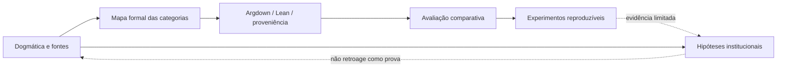

# Raciocínio Jurídico Auditável: síntese atualizada de um programa de pesquisa

**Franklin Silveira Baldo**  
Independent Researcher

> **Nota de escopo.** Esta síntese é um mapa do estado atual do programa no repositório, não uma reivindicação agregada de novidade sobre todos os componentes nem uma declaração de que todos os papers já foram publicados externamente ou validados empiricamente. A versão arquivável incorpora as correções de prior art e de domínio feitas nos papers 1A–1G, no pipeline Lean/Argdown, na proveniência, no ESHTR e no protocolo empírico. Sempre que um componente continua prospectivo, o texto o chama de hipótese, proposta ou protocolo.

## Resumo

O programa **Raciocínio Jurídico Auditável** investiga como tornar argumentos jurídicos mais rastreáveis sem confundir três tarefas diferentes: determinar o que o direito exige, representar formalmente uma cadeia argumentativa e avaliar empiricamente se determinada ferramenta melhora a produção ou a revisão de argumentos.

A linha dogmática foi progressivamente estreitada por auditorias de prior art. O alcance amplo dos embargos declaratórios e a possibilidade de modificação como consequência da integração são doutrina e jurisprudência anteriores ao programa; a contribuição residual do Paper 1A é sobretudo uma síntese operacional da formulação do pedido e uma proposta delimitada sobre `unique determination`. A taxonomia do Paper 1B organiza modos de relação com precedentes, mas não cria a possibilidade de crítica racional de precedentes por órgãos inferiores nem transforma `abstenção da invocação` em saída legítima. O Paper 1D restringe o diálogo institucional ao que a competência e o procedimento permitem. Papers 1E e 1F formulam hipóteses mais estreitas sobre custos argumentativos e reputação local, não leis demonstradas de mudança institucional. O Paper 1G abandona uma genealogia causal forte: o CPC de 1939 já codificava `livre convencimento + motivação` antes da chegada de Liebman ao Brasil; resta apenas uma hipótese limitada sobre a forma de absorção de ideias jurídicas.

Na linha técnico-metodológica, Argdown e Lean oferecem superfícies de auditoria complementares, e não uma oposição simplista entre aciclicidade e compilação. A proveniência de afirmações é tratada como metadado de rastreabilidade, não como fonte automática de coisa julgada, preclusão ou autoridade. O ESHTR continua um método/protocolo de avaliação sujeito a confounds e não identifica uma ordenação global apenas a partir de rankings locais e campeões. O paper empírico, por sua vez, **ainda não reporta um resultado executado**: sua versão Zenodo só deverá ser congelada após uma experiência reproduzível no corpus TJRO/CausaGanha.

O programa, portanto, não sustenta que ferramentas de IA já tenham deslocado o equilíbrio institucional do direito brasileiro. A tese integradora é mais modesta e falsificável: reduzir o custo de produzir e inspecionar argumentos auditáveis **pode** alterar alguns incentivos e canais de engajamento, mas o efeito depende de competência institucional, qualidade efetiva, custos de triagem, observabilidade reputacional e persistência de práticas profissionais. Esses efeitos precisam ser medidos separadamente.

**Palavras-chave:** raciocínio jurídico; auditabilidade; precedentes; CPC 2015; Lean 4; proveniência; avaliação de LLMs; custos argumentativos; reputação; formalização jurídica.

---

## 1. Arquitetura do programa

O programa pode ser lido em quatro camadas:

1. **regras e distinções jurídicas** — o que pode ser afirmado com base no CPC, na jurisprudência e na doutrina;
2. **representação formal e rastreabilidade** — como decompor argumentos, registrar premissas, dependências e proveniência;
3. **avaliação comparativa** — como comparar peças ou sistemas sem tratar preferências de LLM como verdade jurídica;
4. **efeitos institucionais** — hipóteses sobre custos, engajamento e reputação que exigem validação própria.

A separação evita um erro recorrente: transformar uma melhoria técnica em conclusão sociológica. Um pipeline pode tornar dependências mais visíveis sem provar que tribunais passarão a decidir melhor; um ranking pode reduzir custo de comparação sem provar validade dogmática; e um texto juridicamente correto não demonstra que sua adoção alterará o equilíbrio reputacional do campo.



As setas sólidas indicam dependência metodológica; a seta tracejada para a camada institucional lembra que resultados operacionais não estabelecem automaticamente causalidade sistêmica.

---

## 2. Estado atual do eixo dogmático

### 2.1 Paper 1A — Embargos de Declaração

O núcleo jurídico amplo não é uma descoberta do programa. A doutrina e a jurisprudência anteriores já reconheciam que omissão, contradição e obscuridade podem incidir sobre matéria de mérito e que uma alteração do resultado pode ser consequência necessária da correção do vício. Nery Jr. e Rosa Nery pertencem a essa linhagem antecedente, e não a uma posição oposta.

A contribuição residual do Paper 1A é mais estreita:

- organizar a distinção como `modo do vício`, não `objeto do vício`;
- recomendar formulação do pedido centrada na correção do vício, deixando a modificação seguir quando juridicamente necessária;
- explorar, com linguagem limitada, a fronteira `unique determination` entre integração reconhecível e cognição potencialmente generativa.

O paper não atribui essa arquitetura ao CPC 2015 como origem histórica.

### 2.2 Paper 1B — relações possíveis com precedentes

A versão atual abandona a antiga formulação de cinco “saídas legítimas” quando ela incluía `abstenção da invocação` e tratava `superação racional` de modo insensível à competência.

A taxonomia serve hoje como instrumento analítico para distinguir, conforme o regime aplicável:

- aplicação;
- distinguishing;
- reconhecimento de mudança normativa ou superveniente relevante;
- crítica/sinalização racional por órgão que não detenha competência para revisão formal;
- revisão, superação ou cancelamento apenas pelo mecanismo e órgão juridicamente competentes.

A categoria `aplicação parcial silenciosa` permanece uma descrição diagnóstica limitada: uso seletivo de um precedente sem enfrentar condicionantes ou ressalvas materialmente relevantes. Ela não é apresentada como primeira formulação histórica exaustivamente comprovada.

### 2.3 Paper 1C — mapa para formalização

O Paper 1C foi reconstruído para servir como mapa descritivo source-bounded. Entre as correções incorporadas:

- art. 322: pedido **certo**;
- art. 324: pedido **determinado**, com exceções legais de genericidade;
- art. 356: julgamento parcial apenas por incontroversibilidade ou condições do art. 355;
- art. 487, II: prescrição/decadência; art. 487, III: hipóteses homologatórias;
- arts. 503/504: fundamentos não se tornam coisa julgada automaticamente;
- art. 1.013: extensão recursal, profundidade e julgamento imediato permanecem objetos distintos.

O `quadro de rationes candidatas` passou a ser explicitamente uma **heurística computacional**. Quando votos convergem no resultado mas não em uma razão majoritária demonstrável, o sistema preserva candidatos e incerteza; não fabrica uma ratio vinculante por similaridade.

### 2.4 Paper 1D — diálogo e competência

A tese atual não é `forma, não resultado` nem a ideia de que fundamentação suficiente autorize qualquer afastamento de precedente vinculante. Vinculação continua vinculando.

O mecanismo institucional residual é:

```text
argumento inferior juridicamente admissível
→ canal processual disponível
→ engajamento fundamentado do tribunal competente
→ preservação, distinção ou eventual evolução formal pelo mecanismo competente
```

A Rcl 24.026/DF e a literatura anterior já ocupam parte da ideia de reclamação como canal de diálogo. O paper contribui, quando muito, pela integração e pelo enquadramento operacional dessa arquitetura dentro de limites de competência.

### 2.5 Paper 1E — custos argumentativos

A proposição genérica `IA reduz custos → aumenta atividade jurídica → acelera mudança` tem antecedentes econômicos e tecnológicos. O paper atual não a trata como descoberta nem como resultado observado.

Sua hipótese específica é brasileira e condicional: se ferramentas reduzirem o custo de produzir **argumentos auditáveis de qualidade**, e se houver um canal institucional que imponha ou favoreça engajamento, o equilíbrio de investimento argumentativo pode mudar.

Há um canal rival igualmente explícito:

```text
redação barata
→ aumento de volume/ruído
→ maior custo de triagem
→ menor engajamento marginal
```

Qual canal domina é questão empírica.

### 2.6 Paper 1F — reputação

O paper não sustenta mais uma democratização reputacional sistêmica. Informação assimétrica, reputação como proxy e uso de sinais objetivos de qualidade são fenômenos anteriores.

A hipótese residual é local: violações ou qualidades argumentativas textualmente verificáveis podem atualizar a confiança de atores que observam repetidamente o trabalho de determinado profissional ou instituição. Isso exige observabilidade, atribuição, custo de verificação suficientemente baixo e incentivos para usar a informação.

A propagação desse choque local para uma rede reputacional ampla é uma segunda etapa não demonstrada.

### 2.7 Paper 1G — cronologia e absorção

O Paper 1G foi substancialmente corrigido. O art. 118 do CPC de 1939 já combinava livre formação do convencimento na apreciação da prova com dever de indicação dos motivos antes de Liebman chegar ao Brasil em 1940. A processualística posterior não pode ser tratada como criadora dessa forma legal.

A literatura também já conectava patrimonialismo/personalismo ao processo civil e à cultura de precedentes, estudava `livre convencimento` como prática social e criticava o solipsismo judicial.

Resta como hipótese estreita a `absorptive form-selection`: características do campo receptor podem influenciar se uma ideia é recebida como validação retrospectiva de práticas existentes ou como padrão prospectivo de transformação. Essa hipótese compete com explicações publicistas/italianas e teorias gerais de transplante e recepção jurídica.

---

## 3. Estado atual do eixo técnico-metodológico

### 3.1 Argdown + Lean: superfícies diferentes de auditoria

A versão corrigida de `pipeline_lean_argdown.md` não sustenta que argumentation frameworks em geral exigem aciclicidade nem que Lean permite justificar circularidade jurídica por analogia à recursão.

O pipeline distingue superfícies complementares:

- **Argdown / análise argumentativa**: explicita topologia dialética, objeções e relações entre claims;
- **Lean 4**: verifica consequência formal sob premissas declaradas e permite inspecionar dependências transitivas, inclusive com `#print axioms`;
- **revisão jurídica substantiva**: decide se axiomas, classificações e traduções correspondem ao direito e ao registro factual.

Compilação prova consistência relativa às premissas formalizadas; não prova que essas premissas sejam juridicamente corretas.

### 3.2 Proveniência

`proveniencia_claims.md` e o Paper 1C usam proveniência para tornar a cadeia documental inspecionável. A ideia geral de provenance-aware representation, argument graphs e estados não resolvidos tem amplo prior art.

A contribuição candidata é uma disciplina mais específica para documentos processuais: registrar a fonte, o papel argumentativo e mudanças de função ao longo da cadeia sem esconder dependências `pendente`.

O programa não deve inferir automaticamente de uma aresta de derivação que a proposição foi admitida, precluiu, transitou em julgado ou entrou no escopo recursal. Esses efeitos têm requisitos jurídicos próprios.

### 3.3 ESHTR

O ESHTR organiza comparações em torno de agrupamento semântico e julgamentos pareados, mas permanece um método em validação. A literatura anterior já ocupa boa parte de pairwise ranking, divide-and-conquer e ranking por LLMs.

A versão corrente deve preservar três limites:

1. rankings locais mais ordenação de campeões **não identificam automaticamente uma ordenação global completa**;
2. a Semantic Proximity Hypothesis — distância semântica aumentando inconsistência/ciclos — é hipótese, não fato estabelecido;
3. avaliação por júri de LLMs exige calibração externa, inclusive revisão humana/especialista quando a claim é qualidade jurídica.

Para o exemplo `n=1000, k=20`, a contagem corrigida do desenho discutido no repositório é 24.690 comparações, aproximadamente 95,06% abaixo das 499.500 comparações de todos os pares — não ~99,7%.

### 3.4 Avaliação empírica TJRO

`empirical_evaluation.md` não fornece ainda “a avaliação empírica” do programa. O corpus TJRO já existe na infraestrutura CausaGanha e o desenho é executável, mas o paper Zenodo só deverá ser congelado após pelo menos um resultado real e reproduzível.

O requisito atual é simples:

- consulta/sample manifest reproduzível do Parquet TJRO;
- configuração de modelo/prompt/rubrica;
- outputs e estatísticas agregadas preservados;
- abstract/results/conclusion escritos a partir do que foi realmente executado.

Enquanto isso, qualquer referência nesta síntese ao TJRO é referência a **protocolo e infraestrutura**, não a confirmação empírica.

---

## 4. Hipótese integradora

O programa permite formular uma hipótese conjunta sem saltar da ferramenta para a sociologia.

Considere quatro variáveis observáveis ou estimáveis:

- `C_a`: custo de produzir argumento auditável;
- `Q_a`: qualidade/auditabilidade efetiva do argumento produzido;
- `E_i`: probabilidade de engajamento institucional juridicamente relevante;
- `S_r`: atualização reputacional observável no canal considerado.

Uma tecnologia pode reduzir `C_a` sem aumentar `Q_a`. Pode aumentar `Q_a` sem alterar `E_i`. Pode alterar `E_i` localmente sem gerar propagação ampla de `S_r`.

A hipótese do programa é, portanto, uma cadeia condicional:

```text
redução de C_a
+ preservação/aumento de Q_a
+ canal institucional competente que torne Q_a relevante
+ observabilidade repetida
→ possível mudança local de incentivos e reputação
```

Ela falha se a redução de custo vier acompanhada de ruído suficiente para aumentar triagem, se os canais processuais não permitirem engajamento, se qualidade não for observável ou se reputação continuar dominada por outros sinais.

O programa não apresenta, nesta síntese, evidência longitudinal suficiente para declarar que essa mudança sistêmica já ocorreu.

---

## 5. O que está estabelecido, proposto e ainda não testado

| Camada | Estado nesta versão |
|---|---|
| Texto vigente do CPC e distinções jurídicas source-bounded | base normativa/descritiva |
| Linhagens de prior art identificadas nos audits | antecedentes, não contribuição própria |
| Redações/taxonomias operacionais dos Papers 1A–1D | sínteses e propostas delimitadas |
| `quadro de rationes candidatas` | heurística proposta, não regra jurídica |
| Pipeline Argdown → Lean → revisão jurídica | arquitetura/metodologia; superfícies de auditoria distintas |
| Proveniência/status de claims | disciplina de rastreabilidade; efeitos jurídicos avaliados à parte |
| ESHTR/SPH | protocolo/hipótese em validação |
| Efeito de IA sobre custos, engajamento e reputação | hipótese institucional condicionada |
| Genealogia patrimonialista do livre convencimento | tese forte abandonada; resta hipótese limitada de absorção |
| Avaliação TJRO | ainda sem resultado executado congelável |

Essa tabela é deliberadamente menos triunfal que versões anteriores. Ela melhora a utilidade científica da síntese porque impede que maturidade de um componente seja herdada artificialmente por outro.

---

## 6. Proveniência da própria síntese

A síntese deve ser reconstruída a partir dos artifacts atuais, não de descrições históricas que já foram superadas. As referências internas centrais desta versão são:

- `paper1A_embargos_declaracao.md` e `audits/prior-art/paper1a-embargos-declaracao-2026-09-18.md`;
- `paper1B_cinco_saidas_precedentes.md` e seu audit de prior art;
- `paper1C_categorias_processuais_formalizacao.md` e `audits/prior-art/paper1c-rationes-candidatas-provenance-2026-09-19.md`;
- `paper1D_vinculacao_racional_dialogo_institucional.md` e seu audit;
- `paper1E_custos_argumentativos.md` e seu audit;
- `paper1F_reputacao_sistema_juridico.md` e seu audit;
- `paper1G_livre_convencimento_patrimonialismo.md` e `audits/prior-art/paper1g-livre-convencimento-patrimonialismo-2026-09-18.md`;
- `pipeline_lean_argdown.md` e `audits/prior-art/pipeline-lean-argdown-2026-09-18.md`;
- `proveniencia_claims.md` e `audits/prior-art/proveniencia-claims-2026-09-18.md`;
- `embedding_seeded_tournament.md` e seus audits, inclusive a correção posterior sobre identificabilidade global;
- `empirical_evaluation.md`, cuja prontidão continua dependente de execução real.

Se qualquer child paper mudar materialmente, esta síntese deve ser tratada como snapshot versionado, não como fonte de verdade concorrente.

---

## 7. Limitações

Primeiro, o programa reúne dogmática, engenharia, ciência empírica e teoria institucional. Evidência de uma camada não deve ser promovida automaticamente para outra.

Segundo, vários papers são position/method papers. O fato de serem arquiváveis e citáveis não significa que suas hipóteses tenham sido confirmadas.

Terceiro, rankings produzidos por LLMs são instrumentos de medida imperfeitos. Validade jurídica precisa de calibração externa adequada ao claim.

Quarto, formalização em Lean verifica consequências de premissas, não a verdade jurídica ou fática das próprias premissas.

Quinto, argumentos sobre custos e reputação são sensíveis a seleção, observabilidade, incentivos, triagem e competência institucional. A causalidade sistêmica permanece aberta.

Sexto, a linha histórico-institucional foi deliberadamente enfraquecida após correção cronológica; isso é um ganho de integridade, não uma lacuna a ser escondida.

---

## 8. Conclusão

O programa continua coerente, mas sua coerência não depende de cada componente ser novo nem de todas as hipóteses serem verdadeiras.

O eixo dogmático fornece restrições e distinções que impedem que o formalizador atribua ao processo civil efeitos que o CPC não dá. O eixo técnico procura tornar premissas, dependências e incertezas visíveis. O eixo de avaliação tenta comparar artefatos sem confundir ranking com verdade. E o eixo institucional transforma possíveis efeitos de custo e reputação em hipóteses falsificáveis, não em resultados presumidos.

A contribuição agregada que esta síntese defende é a **arquitetura de separação e rastreabilidade**: fonte jurídica, interpretação, formalização, avaliação e inferência institucional devem permanecer conectadas, mas identificáveis. Uma cadeia auditável não elimina julgamento; ela torna explícito onde o julgamento entrou e o que depende dele.

---

*Versão 0.1 da síntese do programa, preparada como preprint reproduzível. Nenhum resultado empírico não executado é apresentado como confirmado.*