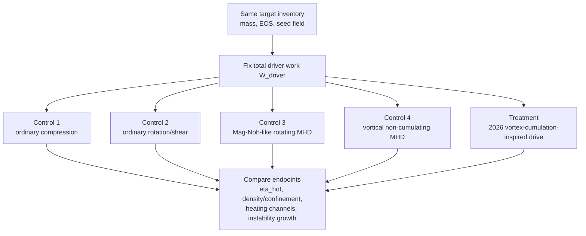

# From Vortex Blowup to Magnetized Hotspots

## A falsifiable research agenda for anisotropic cumulation in fusion plasmas

> **Scientific position paper / research agenda — 8 September 2026.** The Navier–Stokes result motivating this note was announced by OpenAI today and is treated here as a newly released mathematical result, not as an independently settled physical discovery. No fusion experiment or fusion-performance simulation reported in this paper has been performed by the author. The central contribution is a scaling comparison, a literature synthesis, and a set of falsifiable next tests.

## Abstract

OpenAI's newly released construction of finite-time blowup for forced three-dimensional incompressible Navier–Stokes produces an anisotropic vortex core whose radial and axial scales collapse while characteristic velocity and velocity gradients diverge. At first sight this resembles an extreme hydrodynamic energy-focusing mechanism and invites comparison with magnetized-target fusion (MTF), magnetized liner inertial fusion (MagLIF), Z pinches, and other implosive fusion concepts.

The direct analogy fails in an important and useful way. In the announced Navier–Stokes scaling, the **kinetic energy contained in the singular core tends to zero**, even while local speed diverges. At constant density, its characteristic areal density also tends to zero. The construction therefore does not provide a hidden finite-energy reservoir, an "energy sink," or a direct route to an inertial-fusion hotspot. What diverges is instead **specific kinetic energy, shear, and instantaneous dissipation density/rate** in a vanishing mass and volume.

That negative result suggests a narrower research question. Fusion-relevant plasmas already provide mechanisms absent from incompressible Navier–Stokes: compressive density growth, magnetic-flux amplification, anisotropic Braginskii viscosity, Ohmic heating, and magnetic suppression of thermal transport. None of those ingredients is new here. Pre-existing work already includes specific-energy cumulation for fusion ignition [13], rotating self-similar magnetized implosions with hotspot motivation and stability analysis [12], magnetized-vortex enhancement of viscous and Ohmic heating [14], state-dependent vortex-to-thermal energy conversion [15], and rotation-assisted stabilization of magnetized implosions [16]. Recent MagLIF simulations also explicitly find magnetized viscosity damping vortical structures and converting their kinetic energy into heat [10]. The candidate contribution is therefore only the following conjunction:

**Can the specific 8 September 2026 anisotropic inward-spiral/axial-stretching forced-Navier–Stokes scaling be used as a drive trajectory in compressible resistive MHD so that density and magnetic confinement rise before deliberately accelerated viscous/Ohmic thermalization, and does that trajectory improve hotspot coupling at matched driver work over ordinary compression, ordinary rotation/shear, a Mag-Noh-like rotating self-similar MHD control, and a vortical non-cumulating control?**

This paper proposes a staged computational test of that hypothesis and explicit falsifiers. It does not claim that the forced incompressible trajectory is dynamically reachable, robust, or fusion-favorable once compressibility, magnetic back-reaction, shocks, transport, and kinetic-scale effects are included.

## 1. The result that changes the question

OpenAI's paper *Finite Time Blowup for Navier–Stokes* constructs, for every positive viscosity, a smooth compactly supported force and a three-dimensional incompressible flow starting from rest whose kinetic energy remains uniformly bounded while the velocity becomes unbounded at finite time. The public description emphasizes an inward-spiraling, increasingly elongated vortex core. The result establishes the forced alternatives C/D of the Clay formulation; it is not a proof of blowup for the unforced A/B problem [1, 2].

Write

\[
\tau = 1-t
\]

for the time remaining before the singular time. In the leading-order core described in the paper, with a fixed small parameter \(0<h<1/100\), the characteristic radial and axial scales satisfy [2]

\[
\ell_r \asymp \tau^{1/2},
\qquad
\ell_z \asymp \tau^{1/2-h}.
\]

The core therefore becomes increasingly slender, with volume

\[
V_{\rm core}\asymp \ell_r^2\ell_z
\asymp \tau^{3/2-h}.
\]

Characteristic azimuthal and axial velocities scale as

\[
U\asymp \tau^{-1/2-h},
\]

while the radial velocity scales as \(O(\tau^{-1/2})\). The angular Reynolds number grows without bound, whereas the radial Reynolds number remains order one: radial viscous diffusion remains in the leading balance even as rotation accelerates [2].

These scalings are enough to answer the first fusion question without speculation.

## 2. First result: this is not a finite-energy hotspot

### 2.1 Core energy vanishes

At constant density, the kinetic energy of the fastest part of the core scales as

\[
E_{\rm core}\sim \rho V_{\rm core}U^2
\asymp
\tau^{3/2-h}\tau^{-1-2h}
=
\tau^{1/2-3h}.
\]

Because \(h<1/100\),

\[
\boxed{E_{\rm core}\to 0\quad\text{as}\quad \tau\to0.}
\]

This is not merely an inference: the OpenAI proof explicitly records the same \(\tau^{1/2-3h}\) scaling and notes that the core energy tends to zero [2].

The apparent paradox is resolved by the mass shrinking faster than the squared velocity grows. Thus

\[
U\to\infty
\]

does **not** imply

\[
E_{\rm core}\to\infty.
\]

A turbine, fusion target, or any other load cannot extract infinite work from this divergence. There is less total kinetic energy in the asymptotic core, not more.

### 2.2 Specific energy diverges

The same algebra shows why the geometry remains physically interesting. Core mass scales as

\[
m_{\rm core}\sim \rho V_{\rm core}\asymp \tau^{3/2-h},
\]

so kinetic energy per unit mass scales as

\[
\frac{E_{\rm core}}{m_{\rm core}}
\sim U^2
\asymp \tau^{-1-2h}\to\infty.
\]

Thus the construction is better described as **specific-energy cumulation** rather than total-energy concentration: a vanishing amount of matter carries an ever larger characteristic kinetic energy per unit mass. This is not a new fusion principle by itself: convergent cumulation jets were already proposed as a route to fusion-wave ignition in the 1990s [13]. What is distinctive here is only the source geometry being tested and the proposed MHD continuation/control comparison.

If some fraction of that organized motion could be thermalized, it would correspond to an increasing temperature-equivalent *per particle*. That statement is only a scaling analogy; incompressible Navier–Stokes has no self-consistent plasma temperature, ionization, equation of state, radiation, or fusion reactions.

### 2.3 Shear and instantaneous dissipation diverge

The proof also gives the scale of the integral of squared radial derivatives in the core:

\[
D_{\rm core}\asymp \tau^{-1/2-3h}.
\]

This diverges as the singular time approaches. Yet its remaining time integral is finite:

\[
\int_0^{\tau_0}\tau^{-1/2-3h}\,d\tau
=
\frac{\tau_0^{1/2-3h}}{1/2-3h}
<\infty.
\]

So the construction combines:

- vanishing core energy;
- diverging speed per unit mass;
- diverging instantaneous shear/dissipation scale;
- finite total dissipation over the finite interval.

For fusion, the third item is the interesting one. A hotspot is produced by **thermalization rate and confinement**, not by velocity divergence as such. Prior plasma work already shows that magnetized vortices can enhance viscous and Ohmic heating [14] and that the sign and magnitude of vortex-to-thermal conversion depend on vortex evolution [15]. The existence and timing of a useful thermalization window are therefore hypotheses to test, not consequences of high vorticity.

### 2.4 Constant density gives the wrong areal-density trend

A still stronger direct objection comes from density. The construction is incompressible, so \(\rho\) is fixed. A radial areal-density scale therefore behaves like

\[
\rho\ell_r\asymp \rho\tau^{1/2}\to0.
\]

Conventional inertial-confinement ignition requires not merely high temperature but sufficient fuel density/areal density to confine burn products and limit losses. The Navier–Stokes asymptotic core moves in the opposite direction under this crude proxy: it gets faster and thinner without getting denser.

This yields a useful design constraint:

\[
\boxed{\text{Any fusion-relevant descendant must change the density/magnetic-confinement scaling, not merely reproduce }U\to\infty.}
\]

## 3. Fusion research is already surprisingly close to the geometry

The literature search does not support a claim that "singular focusing for fusion" is a new category. Several mature research lines already exploit convergent, self-similar, rotational, magnetic, and vortical cumulation/heating mechanisms. The possible contribution lies only in importing the **specific anisotropic inward-spiral/axial-stretching forced-Navier–Stokes trajectory** of the 2026 construction into a compressible/resistive MHD test with explicit timing and matched-work controls.

### 3.1 Magnetized target fusion: compress first, heat by compression

In MTF, a magnetized plasma target is compressed on a timescale shorter than its initial thermal-energy confinement time. Compression simultaneously heats the plasma and increases density, while magnetic fields reduce transport losses [3].

Howard et al. report PCS-16 spherical-tokamak compression with a radial compression factor greater than eight while the plasma remained approximately axisymmetric on the reported metric. Their theory section organizes the dynamics around a radial compression factor

\[
C_R(t)=\frac{R_0}{R(t)}.
\]

In the idealized adiabatic baseline, density and temperature rise strongly with compression; non-ideal models then account for thermal transport and resistive flux loss [3]. This is precisely what the incompressible blowup lacks: useful matter is compressed, not simply removed from the shrinking core.

### 3.2 Rotating liquid liners: a literal vortex around a fusion target

The closest engineering cousin is the rotating liquid-liner route pursued by General Fusion. Mangione et al. describe a rotating, imploding liquid metal liner whose inner surface compresses a magnetized plasma target. Their 2024 experiments/numerics maintained a smooth inner surface to at least 7:1 radial compression and found rotational suppression of Rayleigh–Taylor instability in the tested configurations [4].

This is not Navier–Stokes blowup, but it establishes three relevant facts:

1. rotation is already an intentional design variable in a fusion compression system;
2. a collapsing fluid geometry can couple mechanical work into a magnetized target;
3. rotation may improve rather than necessarily worsen implosion stability.

Rotation-assisted stabilization of magnetized implosions was also proposed explicitly before this paper, including Coriolis-assisted inertial-confinement concepts [16]. The historical LINUS/magnetic-compression lineage and General Fusion's work therefore form a natural experimental comparison class for any proposed vortex-cumulation geometry.

### 3.3 Self-similar magnetic cumulation predates the new Navier–Stokes result

There is also direct theoretical prior art on self-similar MHD focusing. Felber, Liberman, and Velikovich derived analytic self-similar solutions for compression of a magnetized plasma by a cylindrical liner, including Ohmic dissipation, thermal conduction, and turbulence in the subsonic treatment [5]. Their companion paper treated supersonic self-similar magnetic cumulation [6]. Liberman and Velikovich had earlier analyzed self-similar motions in Z-pinch dynamics [7].

These papers matter because they prevent an overclaim. A proposal based merely on "self-similar implosion + magnetic flux compression" is old. The research question here is narrower: whether the **anisotropic inward spiral/axial stretching and diverging-shear balance** of [2] supplies a different useful trajectory through MHD state space.

There is also an important caution in the self-similar MHD literature: exact similarity solutions need not be dynamical attractors for generic initial conditions. A useful fusion mechanism must be robust to perturbations, not merely exist as an exact solution.

### 3.4 Rotating self-similar magnetized implosion and hotspot motivation already exist

Beresnyak, Velikovich, Giuliani, and Dasgupta's "Mag Noh" family provides a particularly close pre-existing structural control [12]. It studies self-similar, axisymmetric, rotating magnetized plasma implosion/stagnation in ideal MHD and analyzes stable and unstable regimes. The associated programme also explicitly discusses singular azimuthal current near the origin as potentially relevant to hotspot creation in magnetically driven implosions.

This substantially occupies the generic conjunction "self-similar + rotation + magnetized implosion + hotspot + stability." The present proposal therefore does **not** claim novelty for that combination. The unresolved question is whether the *different* 2026 forced-Navier–Stokes inward-spiral/axial-stretching scaling, continued into resistive and viscous MHD, provides incremental hotspot-coupling value over a Mag-Noh-like control at matched driver work.

### 3.5 Compressible fluids already have genuine implosion singularities

The mathematical bridge from incompressible to compressible singularity formation is not empty either. Merle, Raphaël, Rodnianski, and Szeftel constructed finite-energy smooth data for three-dimensional compressible Euler and compressible Navier–Stokes that develop implosion singularities with infinite density at a point [8, 9].

This is closer to what fusion would need than constant-density blowup because density itself grows. But those results are not fusion designs: they use idealized barotropic equations, do not supply a magnetized plasma burn model, and do not establish that the singular dynamics survive the transport, radiation, ionization, kinetic, and instability physics of a target.

The right conclusion is therefore not "compressible blowup is missing." It is that the literature contains **different pieces of the desired mechanism in different models**.

### 3.6 MagLIF supplies the strongest direct fusion bridge: vortex kinetic energy can become heat

A particularly important 2026 preprint by Sam et al. implements the full Braginskii anisotropic magnetized-viscosity tensor in MagLIF-relevant FLASH simulations. The authors report that magnetized viscosity damps vortical structures, converts kinetic energy in those structures into thermal energy, and mitigates Rayleigh–Taylor instability; seeded-perturbation simulations showed yield preservation when that viscosity was included [10].

This result is not yet a demonstration of vortex-driven ignition and should not be read as one. But it means that the generic conversion arrow

\[
\boxed{E_{\rm vortex}\longrightarrow E_{\rm thermal}}
\]

in a fusion-relevant magnetized plasma model is prior art, not a novelty claim of this paper.

Independent plasma work strengthens that caution. Silva et al. report magnetized vortex tubes that significantly enhance viscous and Ohmic heating [14], while Settino et al. find that vortex energy-conversion direction is state-dependent, with mature rolled-up vortices tending to convert flow energy into internal/thermal energy but earlier stages capable of the reverse transfer [15]. These results make the timing requirement central: useful density and magnetic confinement must be built **before** deliberate rapid thermalization, rather than assuming that more vorticity always means more useful heat.

The new Navier–Stokes construction supplies a mathematical trajectory in which the shear scale becomes extremely large. The quantitative question is therefore: **does an MHD continuation of that particular trajectory create an incremental, usefully timed thermalization pulse beyond already-known rotating/vortical MHD controls before the kinetic reservoir disappears or the flow loses coherence?**

### 3.7 Velocity shear can also stabilize fusion plasmas

Shear is not generically a loss channel in fusion systems. Sheared-flow-stabilized Z-pinch experiments have produced sustained neutron emission and fusion-relevant plasma parameters; Levitt et al. reported elevated electron temperature coincident with observed fusion reactions in a sheared-flow-stabilized Z pinch [11]. The mechanism and geometry are different, but these experiments reinforce the need to treat velocity shear as a potentially functional control variable rather than automatically as unwanted turbulence. They also mean that stability-compatible shear is established background rather than a contribution claimed here.

## 4. The actual research gap

The initial 8 September search located substantial prior art on most ingredients. A later claim-specific temporal audit through 18 September 2026 expanded that search and found especially close antecedents in rotating self-similar magnetized implosion/hotspot physics [12], fusion ignition by cumulation jets [13], magnetized-vortex viscous/Ohmic heating [14], state-dependent vortex-to-thermal energy conversion [15], and rotation-assisted stabilization [16].

These antecedents rule out broad novelty claims for specific-energy cumulation in fusion, rotating self-similar MHD implosion, generic vortex/shear thermalization, or rotation/shear stabilization. They also make a stronger control ladder necessary. The surviving bounded negative-search result is narrower:

> **Candidate gap after the claim-specific audit:** no pre-2026-09-09 work was located that takes the **specific anisotropic inward-spiral/axial-stretching forced-Navier–Stokes scaling announced on 8 September 2026** as a drive trajectory, continues it into compressible resistive MHD, and tests whether density and magnetic confinement can be accumulated **before** deliberately accelerated viscous/Ohmic thermalization, with matched driver work against ordinary compression, ordinary rotation/shear, Mag-Noh-like rotating self-similar MHD, and vortical non-cumulating controls.

This is a bounded search result, not proof of exhaustive novelty. It is a synthesis/experimental-program claim rather than a claim that its physical ingredients are new.

## 5. A model that can actually answer the fusion question

The incompressible equation is the wrong endpoint. A minimal bridge model needs at least compressibility, magnetic induction, an energy equation, resistivity, and anisotropic magnetized viscosity. Schematically:

\[
\partial_t\rho+\nabla\cdot(\rho\mathbf u)=0,
\]

\[
\rho\left(\partial_t\mathbf u+\mathbf u\cdot\nabla\mathbf u\right)
=-\nabla p+\mathbf J\times\mathbf B+\nabla\cdot\Pi+\rho\mathbf f,
\]

\[
\partial_t\mathbf B
=\nabla\times(\mathbf u\times\mathbf B)
-\nabla\times(\eta\mathbf J),
\qquad \nabla\cdot\mathbf B=0,
\]

with an energy equation that retains at minimum

\[
Q_{\rm visc}=\Pi:\nabla\mathbf u,
\qquad
Q_{\rm Ohm}=\eta J^2,
\]

plus electron/ion thermal transport, radiation, and whatever equilibration model is appropriate to the regime.

The objective is **not** to realize a mathematical singularity. A physical plasma will encounter shocks, finite mean-free-path effects, kinetic scales, radiation, and other model changes first. Nor is the forced incompressible solution assumed to be an attractor or a robust trajectory once the model is changed. The desired object is instead a controlled **pre-singular pulse** whose reachability and basin of attraction are themselves measured:

\[
\text{large-scale driver}
\rightarrow
\text{anisotropic convergent rotation/shear}
\rightarrow
\text{density + }B\text{ amplification}
\rightarrow
\text{rapid viscous/Ohmic thermalization}
\rightarrow
\text{magnetically confined hotspot}.
\]

## 6. Three falsifiable hypotheses

### H1 — A thermalization window exists

There exists a finite pre-singular interval in a compressible magnetized continuation of the vortex geometry where useful thermalization rises faster than disassembly and transport losses:

\[
P_{\rm visc}+P_{\rm Ohm}
\quad\text{becomes large while}\quad
\rho,\ B,\ \tau_{\rm conf}
\quad\text{remain fusion-favorable.}
\]

A negative result is scientifically valuable: if viscosity always destroys the focusing structure before significant compressional/magnetic confinement develops, the bridge is closed. Existing state-dependent vortex-energy conversion [15] is a direct warning that such a window cannot be assumed.

### H2 — The geometry improves hotspot coupling at fixed driver work

At the same externally supplied mechanical/electromagnetic work and target inventory, adding the 2026 vortex-cumulation trajectory yields a larger useful hotspot thermal-energy/confinement outcome than each relevant control:

\[
\eta_{\rm hot}
:=
\frac{\Delta E_{\rm th,hot}}{W_{\rm driver}}.
\]

The primary control ladder is:

1. ordinary nonrotating compression;
2. ordinary controlled rotation/shear without the 2026 similarity trajectory;
3. a Mag-Noh-like rotating magnetized self-similar implosion/stagnation family [12];
4. a deliberately vortical but non-cumulating MHD flow calibrated to similar peak vorticity/shear;
5. the proposed 2026 vortex-cumulation-inspired drive.

The metric is intentionally an engineering efficiency, not a singularity diagnostic. If the proposed trajectory does not outperform controls 1–4 under matched work and inventory, the OpenAI-specific geometry has not demonstrated additional causal value.

### H3 — Rotation/shear can be stability-compatible

The trajectory can be chosen so that rotational/shear effects do not trigger Kelvin–Helmholtz, magneto-Rayleigh–Taylor, kink/sausage, or other modes faster than they suppress or outrun them. Prior rotating-liner, Coriolis-assisted, Mag-Noh, and sheared-flow Z-pinch work [4, 12, 16, 11] makes this plausible enough to test, but also means the generic proposition is not new.

## 7. Minimal computational programme

The decisive comparison holds target inventory and driver work fixed and manipulates the drive trajectory. That isolates the scientific question from the visually dramatic but irrelevant fact that the proposed trajectory contains stronger local shear.

A positive result therefore requires better hotspot coupling at matched input work, not merely a larger peak velocity or shear rate.

### Stage 0 — Reproduce the mathematical scaling

Before adding plasma physics, reproduce the released Navier–Stokes leading-order scaling numerically over the resolvable pre-singular range. Measure:

- \(\ell_r(t)\), \(\ell_z(t)\);
- peak azimuthal/axial velocity;
- \(E_{\rm core}\);
- \(\int_{\rm core}|\partial_r u|^2dV\);
- sensitivity to perturbations of the prescribed forcing and initial state.

This is a benchmark, not a fusion simulation. Failure to reproduce the scaling numerically may itself show that the exact construction is too delicate for an engineering continuation.

### Stage 1 — Compressible hydrodynamics without magnetic field

Replace incompressibility by a compressible equation of state while preserving, as far as possible, the initial vortex/strain geometry. Ask:

1. Does density rise in the shrinking region?
2. Does a shock form before the desired vortex-cumulation regime?
3. How does thermal energy partition between coherent compression and shear dissipation?
4. Does the core's areal density now grow rather than vanish?

This stage directly compares the new geometry with the known compressible-implosion literature [8, 9].

### Stage 2 — Resistive MHD with seeded magnetic field

Add a physically appropriate seed field and track:

- magnetic-flux amplification;
- magnetic Reynolds number and resistive diffusion;
- magnetic pressure/tension feedback on the vortex geometry;
- Ohmic heating;
- thermal-transport suppression;
- Hall/magnetization parameters where relevant.

The key question is whether magnetic tension kills the anisotropic stretching, redirects it, or turns it into useful magnetic cumulation.

### Stage 3 — Braginskii viscosity and two-temperature transport

Use the anisotropic-viscosity implementation class demonstrated by Sam et al. [10]. Separately record:

\[
E_{\rm coherent\ vortex},\quad
E_{i,\rm thermal},\quad
E_{e,\rm thermal},\quad
E_B,\quad
E_{\rm radiation},\quad
E_{\rm wall/escape}.
\]

This stage tests the paper's central bridge: whether increasing pre-singular shear can serve as a useful **thermalization accelerator after confinement has been built**, rather than merely reproducing already-known vortex heating or acting as a premature loss mechanism.

### Stage 4 — Compare inside an MTF/MagLIF-like implosion

Only if Stages 1–3 survive should the geometry be embedded in an established target concept. The comparison must keep driver work and target inventory matched. Baselines should include the full H2 ladder: nonrotating compression, ordinary controlled rotation/shear, a Mag-Noh-like rotating self-similar MHD control, and a vortical non-cumulating MHD control, in addition to the proposed trajectory.

Outputs should include ion/electron temperature, density, areal density or the appropriate magnetized-fuel confinement figure, burn-weighted volume, neutron production, instability amplitudes, \(\eta_{\rm hot}\), and a decomposition of heating into compression, viscous, Ohmic, and shock channels as functions of time.

## 8. Falsifiers

The proposed bridge should be abandoned or substantially revised if any of the following robustly occurs across physically relevant parameter ranges:

1. **Vanishing useful mass:** the hottest region remains too small/low-density to contribute materially to burn.
2. **Shock preemption:** compressibility generates shocks that erase the anisotropic vortex mechanism before useful focusing.
3. **Premature viscous damping:** magnetized viscosity thermalizes the vortex too early, before sufficient density and magnetic confinement develop.
4. **Wrong thermal partition:** dissipation preferentially heats an unhelpful species or is rapidly radiated/transported away.
5. **Magnetic back reaction:** tension or pressure prevents the inward-spiral/axial-stretching regime.
6. **Instability dominance:** MRT, Kelvin–Helmholtz, kink/sausage, or other modes grow faster than the useful compression.
7. **No incremental coupling advantage:** at equal driver work and target inventory, \(\eta_{\rm hot}\) is no better than the strongest ordinary-rotation, Mag-Noh-like, or vortical non-cumulating control.
8. **Extreme forcing sensitivity:** the useful trajectory requires an externally prescribed forcing field so fine-tuned that realistic drivers cannot approximate it.
9. **Continuum breakdown too early:** kinetic/nonlocal effects take over before the MHD model reaches the favorable window.

These are not implementation details. They define what would make the idea wrong.

## 9. What would count as a genuine positive result

A useful result does not require mathematical blowup. In fact, actual blowup would be physically meaningless beyond continuum validity. A convincing positive result would instead show, in a validated compressible-MHD model, that a finite and experimentally accessible vortex/shear trajectory produces all of the following at fixed driver work:

1. greater hotspot ion thermal energy than the strongest matched control;
2. sufficient density/confinement rather than only high velocity;
3. magnetic-flux amplification or transport suppression compatible with burn;
4. instability growth no worse than the matched baseline;
5. a reproducible basin of initial/drive conditions rather than a measure-zero exact trajectory;
6. a time-resolved causal sequence in which density/magnetic confinement are built before accelerated viscous/Ohmic thermalization.

That result would justify an experiment. Anything weaker should remain a mathematical/plasma-physics curiosity.

## 10. Interpretation

The strongest conclusion from the literature is narrower than the intuition that motivated the search but more interesting than a simple rejection.

The new Navier–Stokes construction is **not an energy sink and not a fusion mechanism**. Its singular core contains asymptotically *less* total kinetic energy, and incompressibility makes its areal-density scaling directly unfavorable for inertial fusion.

Nor are specific-energy cumulation for fusion [13], rotating self-similar magnetized implosion [12], generic vortex/shear thermalization [10, 14, 15], or stability-compatible rotation/shear [4, 11, 16] new ingredients. The only candidate contribution retained by this paper is the narrower experimental programme that imports the specific 8 September 2026 forced-Navier–Stokes geometry into compressible resistive MHD, requires density and magnetic confinement to rise before accelerated thermalization, and asks whether that trajectory beats the strongest matched controls at equal driver work.

The research opportunity is therefore a cross-model question:

\[
\boxed{
\text{Can compressible MHD turn this particular anisotropic vortex-cumulation trajectory into a finite, dense, magnetically confined thermalization pulse with incremental value over known rotating/vortical controls?}
}
\]

That is testable. It is also sufficiently close to existing MTF/MagLIF, Mag-Noh, cumulation, and vortex-heating research that a negative answer can be obtained without inventing a reactor concept first.

## References

1. OpenAI. "On the Navier–Stokes Millennium Prize Problem." 8 Sep. 2026. https://openai.com/index/navier-stokes-solution/
2. OpenAI. *Finite Time Blowup for Navier–Stokes*. 2026. https://cdn.openai.com/pdf/32d9f210-8b73-45e0-91bc-82a30aef8a9a/navier-stokes.pdf
3. S. J. Howard et al. "Measurement of spherical tokamak plasma compression in a PCS-16 magnetized target fusion experiment." *Nuclear Fusion* 65 (2025) 016029. https://doi.org/10.1088/1741-4326/ad9033
4. A. Mangione et al. "Shape manipulation of a rotating liquid liner imploded by arrays of pneumatic pistons: Experimental and numerical study." *Fusion Engineering and Design* 198 (2024) 114087. https://doi.org/10.1016/j.fusengdes.2023.114087
5. F. S. Felber, M. A. Liberman, and A. L. Velikovich. "Magnetic flux compression by dynamic plasmas. I. Subsonic self-similar compression of a magnetized plasma-filled liner." *Physics of Fluids* 31 (1988) 3675. https://doi.org/10.1063/1.866884
6. F. S. Felber, M. A. Liberman, and A. L. Velikovich. "Magnetic flux compression by dynamic plasmas. II. Supersonic self-similar solutions for magnetic cumulation." *Physics of Fluids* 31 (1988) 3683. https://doi.org/10.1063/1.866885
7. M. A. Liberman and A. L. Velikovich. "Self-similar motions in Z-pinch dynamics." *Nuclear Fusion* 26 (1986) 709. https://doi.org/10.1088/0029-5515/26/6/002
8. F. Merle, P. Raphaël, I. Rodnianski, and J. Szeftel. "On the implosion of a compressible fluid I: Smooth self-similar inviscid profiles." *Annals of Mathematics* 196 (2022). https://doi.org/10.4007/annals.2022.196.2.3
9. F. Merle, P. Raphaël, I. Rodnianski, and J. Szeftel. "On the implosion of a compressible fluid II: Singularity formation." *Annals of Mathematics* 196 (2022), 779–889. https://doi.org/10.4007/annals.2022.196.2.4
10. A. Sam et al. "Development of Anisotropic Magnetized Viscosity for Magnetized Liner Inertial Fusion Simulations in FLASH." arXiv:2604.21149 [physics.plasm-ph], submitted 22 Apr. 2026. https://doi.org/10.48550/arXiv.2604.21149
11. B. Levitt et al. "Elevated Electron Temperature Coincident with Observed Fusion Reactions in a Sheared-Flow-Stabilized Z Pinch." *Physical Review Letters* 132 (2024) 155101. https://doi.org/10.1103/PhysRevLett.132.155101
12. A. Beresnyak, A. L. Velikovich, J. L. Giuliani, and A. Dasgupta. "Stable and unstable supersonic stagnation of an axisymmetric rotating magnetized plasma." *Journal of Fluid Mechanics* (2022). https://doi.org/10.1017/jfm.2022.77 ; arXiv:2112.10828.
13. J. M. Martínez-Val and M. Piera. "Fusion-Burning Waves Ignited by Cumulation Jets." *Fusion Technology* 32(1) (1997), 131–151. https://doi.org/10.13182/FST97-A19885
14. S. S. A. Silva et al. "Solar Vortex Tubes III. Vorticity and Energy Transport." *The Astrophysical Journal* 975(1) (2024) 118. https://doi.org/10.3847/1538-4357/ad781a
15. A. Settino et al. "Energy Conversion Pathways Inside Kelvin–Helmholtz Vortices." *Journal of Geophysical Research: Space Physics* (2026). https://doi.org/10.1029/2025JA034952
16. F. Winterberg. "Coriolis force-assisted inertial confinement fusion." *Laser and Particle Beams* (2019). https://doi.org/10.1017/S0263034619000162
